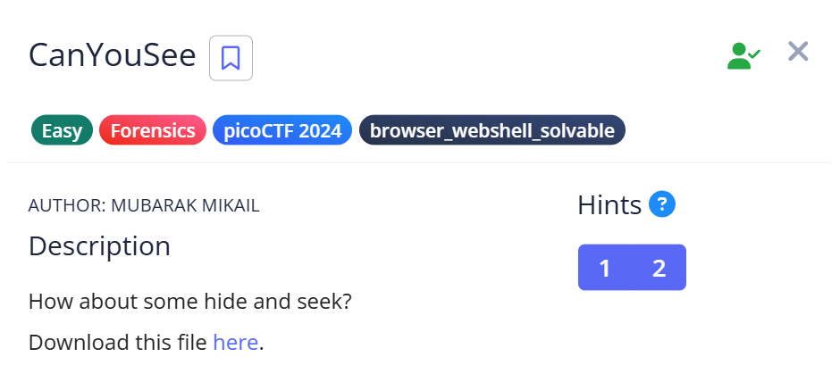
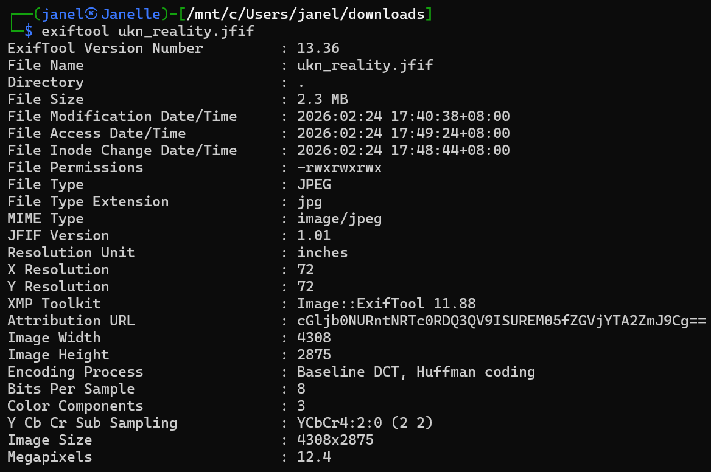
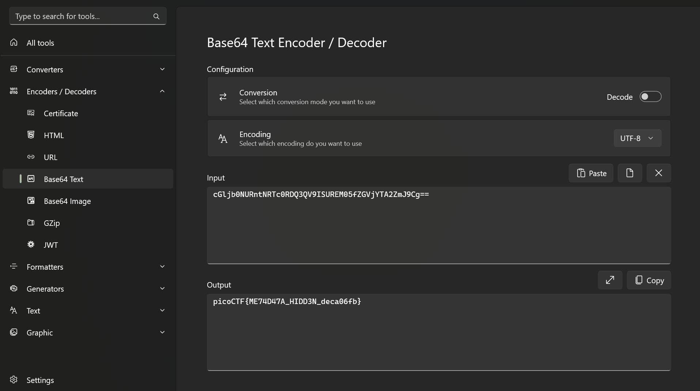

# 📝 Challenge Write-up: CanYouSee

| Attribute | Details |
| :--- | :--- |
| **Event** | picoCTF 2024 |
| **Category** | Forensics |
| **Difficulty** | Easy |
| **Target File** | Downloaded Challenge Image |

## 1. The Challenge Scenario
The challenge provided a file with a brief prompt asking, "How about some hide and seek?" The objective was to find a hidden payload concealed within the provided file. 



## 2. The Step-by-Step Solution
To solve this, I had to pivot from basic text inspection to proper command-line forensics tools after encountering a performance issue.

**Step 1:** I initially attempted to open the file using a basic text editor (Notepad) to look for hidden strings. However, because the file was too large and full of raw binary image data, Notepad went into a "Not Responding" state and crashed.

**Step 2:** Realizing a text editor wouldn't work for this size, I booted up Kali Linux and used `exiftool` via the command line to properly parse the image's metadata.

**Step 3:** Scanning the output from `exiftool`, I found a suspicious string tucked away in the Attribution URL field:
`cGljb0NURntNRTc0RDQ3QV9ISUREM05fZGVjYTA2ZmJ9Cg==`



**Step 4:** Recognizing the `==` padding at the end, I identified this as a Base64 encoded string. Instead of CyberChef, I used the offline utility **DevToys** to decode the string, which cleanly revealed the flag.



## 3. The Findings
The metadata extraction and subsequent Base64 decoding successfully revealed the hidden text:

```text
picoCTF{ME74D47A_HIDD3N_deca06fb}
```

**Target Found:** `picoCTF{ME74D47A_HIDD3N_deca06fb}`

## 4. Conclusion
This task demonstrated two important lessons. First, it showed that **image metadata** (like the Attribution URL) is a prime location for hiding encoded payloads. Second, it highlighted why using dedicated forensic CLI tools (like `exiftool` on Kali Linux) is far more efficient and stable than trying to force a standard text editor to read large binary files.
