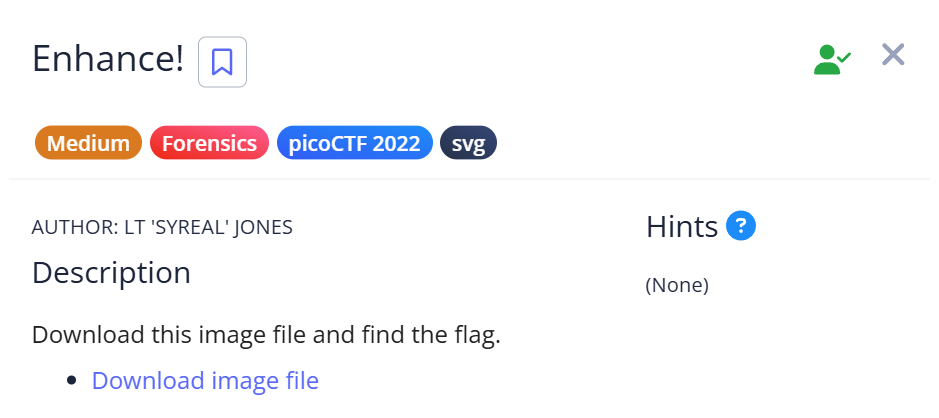
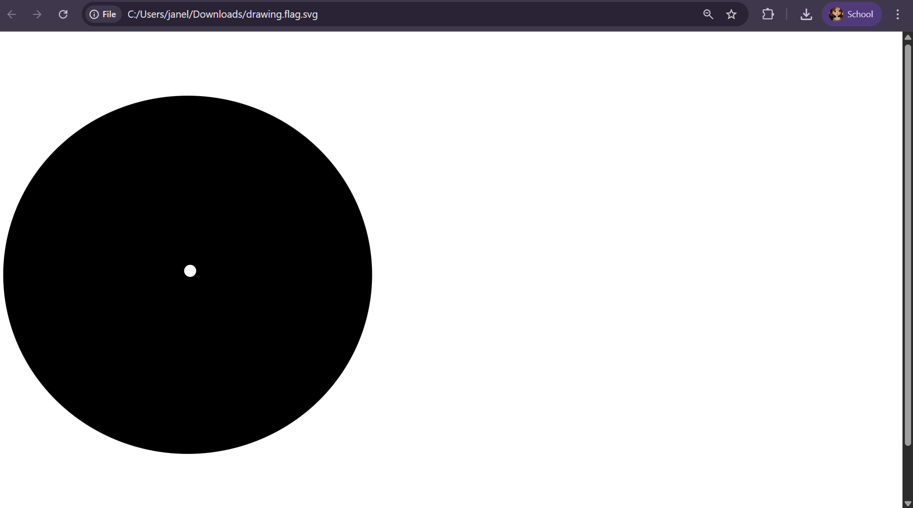

# 📝 Challenge Write-up: Enhance!

| Attribute | Details |
| :--- | :--- |
| **Event** | picoCTF |
| **Category** | Forensics |
| **Difficulty** | Medium |
| **Target File** | `drawing.flag.svg` |

## 1. The Challenge Scenario
We were provided with an image file that appeared to be a simple vector drawing. The objective was to find the flag that was somehow hidden inside or visually obscured within the picture itself. 



## 2. The Step-by-Step Solution
Instead of using command-line tools or reading the raw code, I solved this by treating the image like a webpage in my browser.

**Step 1:** I downloaded the target image file and opened it directly in a web browser. 

**Step 2:** The browser displayed the picture normally. Suspecting that there might be invisible or incredibly tiny text layered in the image, I used the "Select All" keyboard shortcut (`Ctrl + A`).



**Step 3:** With everything on the screen highlighted, I copied the selection (`Ctrl + C`) and pasted it (`Ctrl + V`) into a blank Notepad file.

**Step 4:** The paste successfully caught the hidden text that the browser had rendered. It pasted out with spaces between every character, looking exactly like this:

```text
p i c o C T F { 3 n h 4 n c 3 d _ d 0 a 7 5 7 b f }
```

**Step 5:** I simply removed all the extra spaces to reconstruct the final, valid flag format.

## 3. The Findings
By selecting and pasting the hidden text elements from the browser, the flag was revealed:

```text
picoCTF{3nh4nc3d_d0a757bf}
```

**Target Found:** `picoCTF{3nh4nc3d_d0a757bf}`

## 4. Conclusion
This challenge is a great demonstration of how Scalable Vector Graphics (SVG) actually work. Because SVGs are built using text-based XML code, any text embedded inside them is rendered by the browser as actual, selectable text—even if it is drawn microscopically small or hidden behind other shapes. Sometimes, a simple `Ctrl + A` and copy-paste is all it takes to extract hidden data without needing to look at the raw source code.
