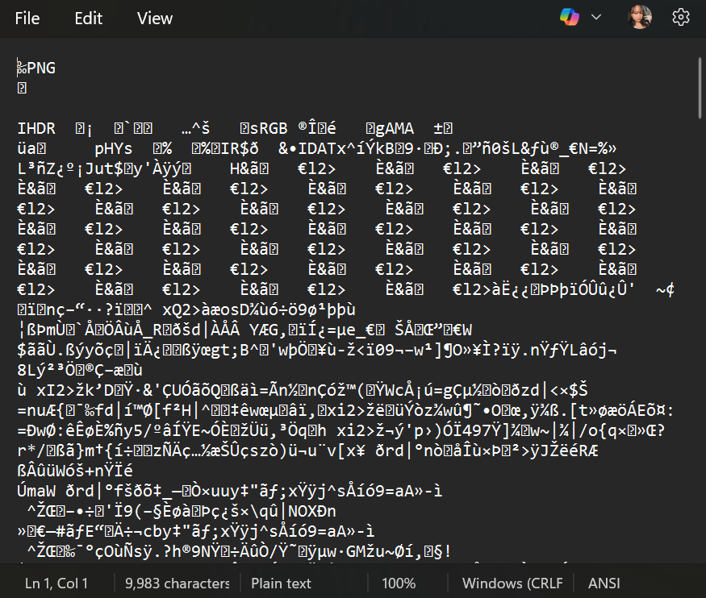
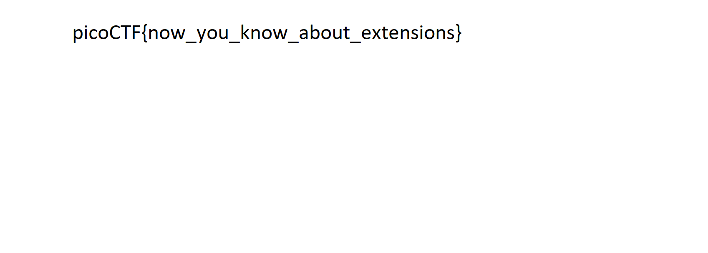

# 📝 Challenge Write-up: extensions

| Attribute | Details |
| :--- | :--- |
| **Event** | picoCTF |
| **Category** | Forensics |
| **Difficulty** | Medium |
| **Target File** | `flag.txt` |

## 1. The Challenge Scenario
We were provided with a file that appeared to be a standard text file based on its name. However, attempting to open it as normal text might result in gibberish or an error. The objective was to determine the true nature of the file and extract the hidden flag.


## 2. The Step-by-Step Solution
To solve this, I used a basic text editor to inspect the file's headers and determine its actual format.

**Step 1:** I downloaded the target file. Even though it might have been labeled as a text file, I needed to verify its actual contents.

**Step 2:** I opened the file directly in **Notepad** to view the raw data. At the very top of the seemingly random text, the first few characters clearly read: `PNG`.



**Step 3:** Recognizing that this "text" file was actually an image in disguise, I closed Notepad and renamed the file, changing its extension to **.png**.

```text
flag.png
```

**Step 4:** Once the extension was corrected, the operating system recognized it as an image. I opened the newly renamed `.png` file, which displayed a viewable picture with a plain background containing the flag.



## 3. The Findings
By correcting the file extension to match its true header, the image was restored, revealing the flag:

```text
picoCTF{now_you_know_about_extensions}
```

**Target Found:** `picoCTF{now_you_know_about_extensions}`

## 4. Conclusion
This challenge is a perfect demonstration of how file extensions work—or rather, how they can lie. An operating system often relies on the file extension (like `.txt` or `.png`) to know what program to use. However, the *true* file type is always dictated by the "magic bytes" (the file signature) hidden at the very beginning of the file's raw data. By checking the raw data in Notepad, you can easily identify mislabeled files and restore their proper extensions.
