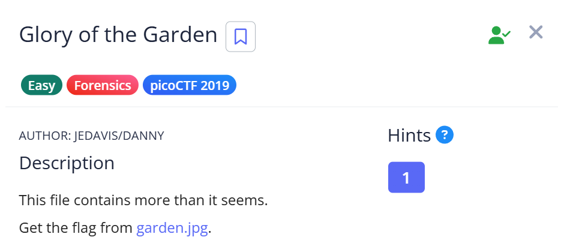
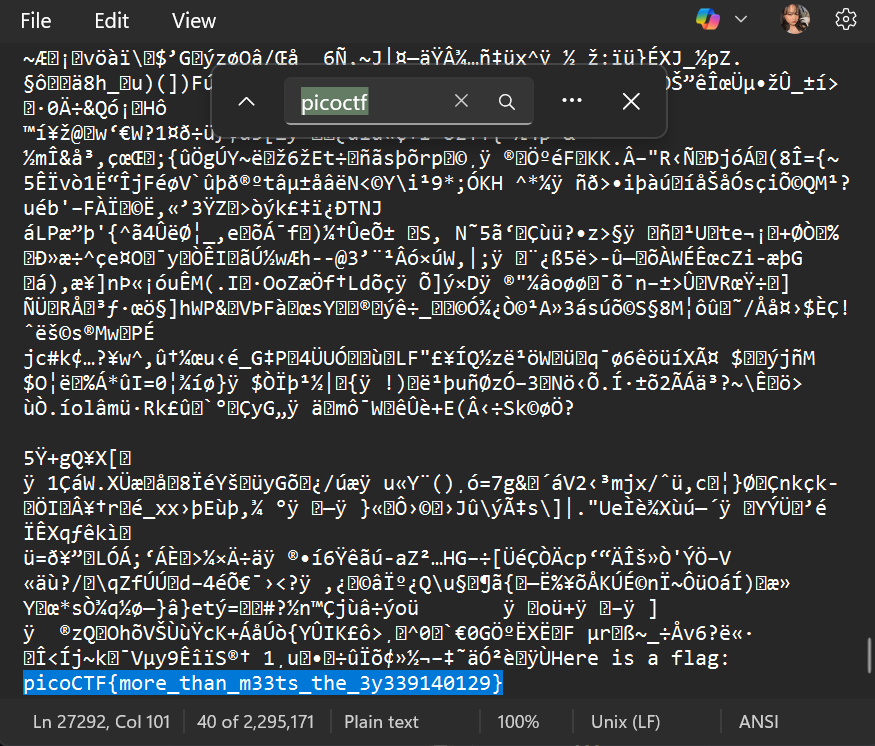

# 📝 Challenge Write-up: Glory of the Garden

| Attribute | Details |
| :--- | :--- |
| **Event** | picoCTF 2019 |
| **Category** | Forensics |
| **Difficulty** | Easy |
| **Target File** | `garden.jpg` |

## 1. The Challenge Scenario
A file named `garden.jpg` was provided with a very simple description: "This file contains more than it seems." The objective was to inspect the image and extract the hidden flag. 



## 2. The Step-by-Step Solution
This was a very straightforward challenge that didn't require complex command-line tools, just a basic text editor and a search function.

**Step 1:** I downloaded the target image file (`garden.jpg`).

**Step 2:** Instead of using an image viewer, I opened the image directly in **Notepad** to view its raw data. While most of the file looked like gibberish binary characters, I knew the flag would be in plain text.

**Step 3:** I used the built-in "Find" tool (`Ctrl + F`) and searched for the standard flag keyword: `picoCTF`.



**Step 4:** The search immediately jumped to the bottom of the file, where the flag was hidden in plain sight among the raw string data.

## 3. The Findings
The simple text search was highly effective and revealed the hidden text:

```text
picoCTF{more_than_m33ts_the_3y339140129}
```

**Target Found:** `picoCTF{more_than_m33ts_the_3y339140129}`

## 4. Conclusion
This task demonstrated that you don't always need advanced tools like `exiftool` or `steghide` for basic digital forensics. Often, challenge creators simply append clear-text strings to the end of an image file. Opening the file in a standard text editor and using `Ctrl + F` (or using the `strings` command in Linux) is a fast, simple, and essential first step for any forensics challenge.
