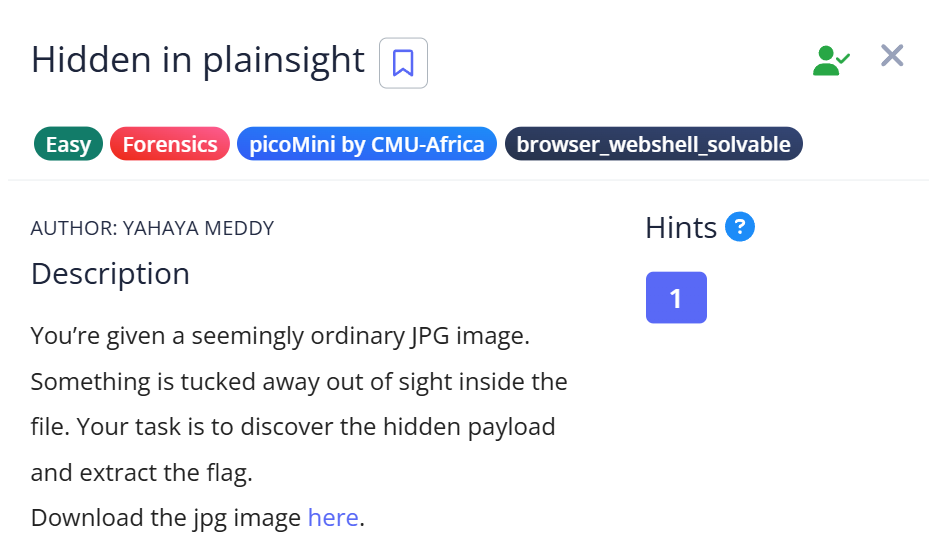
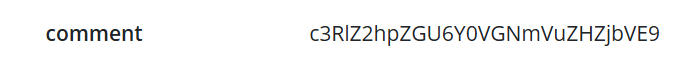
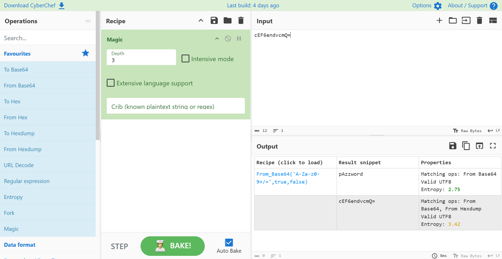
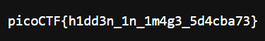

# 📝 Challenge Write-up: Hidden in plainsight

| Attribute | Details |
| :--- | :--- |
| **Event** | picoMini by CMU-Africa |
| **Category** | Forensics / Steganography / Metadata |
| **Difficulty** | Easy |
| **Target File** | `img.jpg` |

## 1. The Challenge Scenario
A seemingly ordinary **JPG image** was provided that looked like random noise when opened. The objective was to discover a payload tucked away out of sight inside the file and extract the flag. This required checking the file's metadata for clues and using steganography tools to retrieve the hidden data.



## 2. The Step-by-Step Solution
To solve this, I chained together metadata extraction, Base64 decoding, and a steganography extraction tool.

**Step 1:** I checked the image's metadata and found an unusual string hidden in the comment field: `c3RlZ2hpZGU6Y0VGNmVuZHZjbVE9`.



**Step 2:** Recognizing this as Base64, I used CyberChef to decode it, which outputted: `steghide:cEF6endvcmQ=`. This revealed that the tool `steghide` was used, and provided a second Base64 string.

**Step 3:** I decoded the second Base64 string (`cEF6endvcmQ=`), which gave me the passphrase: `pAzzword`.



**Step 4:** Knowing the tool and the passphrase, I uploaded the image to [futureboy.us/stegano](https://futureboy.us/stegano/decinput.html) (a web interface for Steghide), input the passphrase `pAzzword`, and extracted the hidden payload.

## 3. The Findings
The extraction was successful and revealed the hidden text containing the flag:



```text
picoCTF{h1dd3n_1n_1m4g3_5d4cba73}
```

**Target Found:** `picoCTF{h1dd3n_1n_1m4g3_5d4cba73}`

## 4. Conclusion
This task demonstrated how attackers or challenge creators can hide multiple layers of information. It showed that **image metadata** can be used to hide crucial hints or passwords, and that **steganography** tools like `steghide` can securely conceal entirely different files or text payloads within standard image formats.
