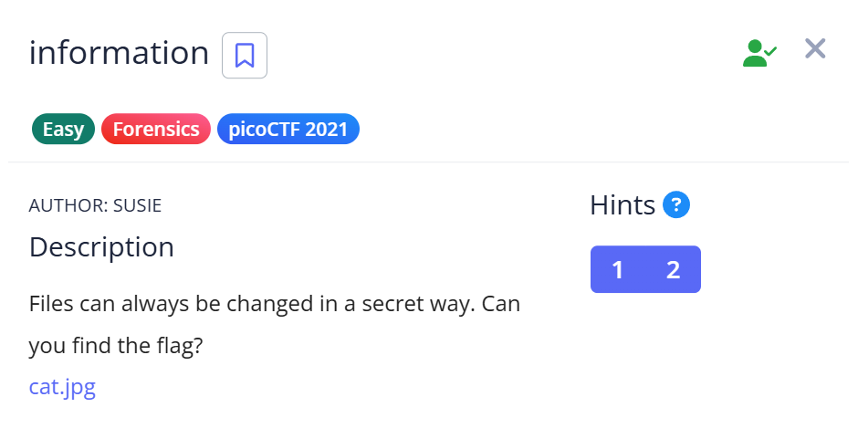
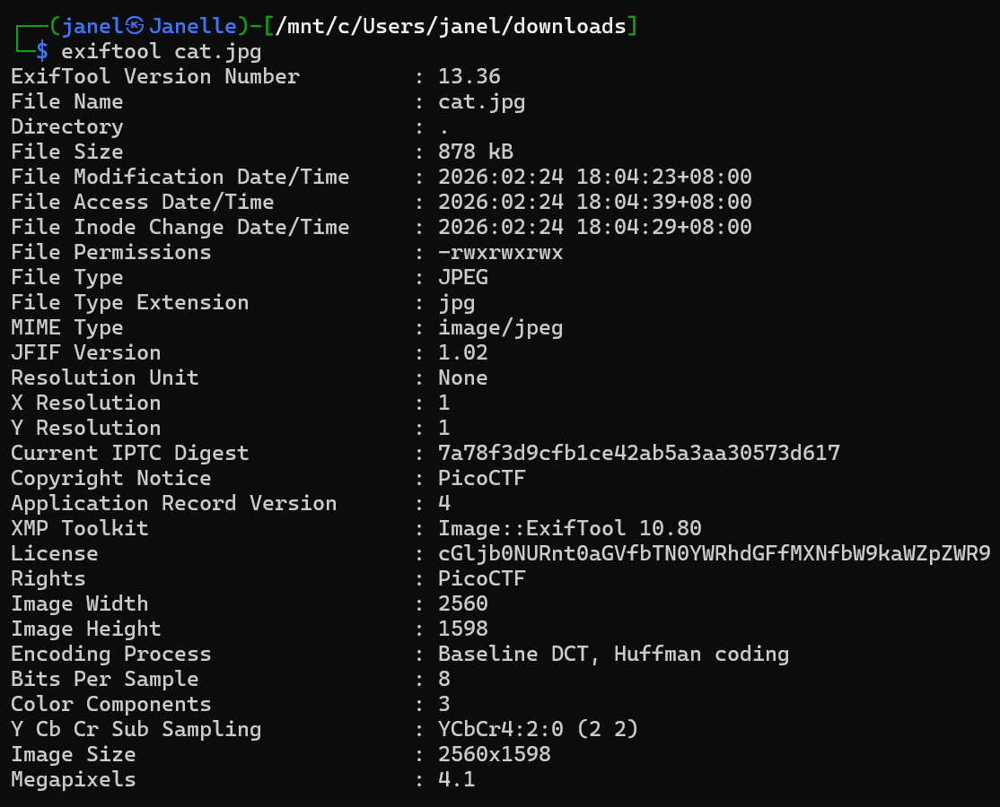
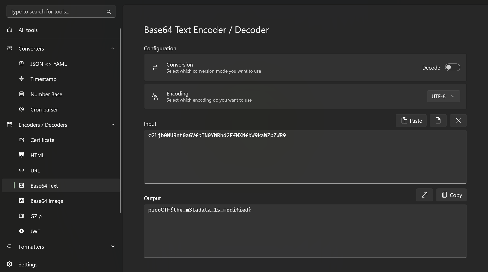

# 📝 Challenge Write-up: information

| Attribute | Details |
| :--- | :--- |
| **Event** | picoCTF 2021 |
| **Category** | Forensics |
| **Difficulty** | Easy |
| **Target File** | `cat.jpg` |

## 1. The Challenge Scenario
A file named `cat.jpg` was provided with the hint: "Files can always be changed in a secret way. Can you find the flag?" The objective was to inspect the image file to uncover the hidden flag, implying that the image itself had been modified or that data was concealed within its structure.



## 2. The Step-by-Step Solution
To solve this challenge, I relied on command-line forensic tools to extract the file's metadata and an offline utility to decode the payload.

**Step 1:** I downloaded the target image file (`cat.jpg`).

**Step 2:** I opened my Kali Linux terminal and ran `exiftool` against the image to inspect its metadata properties. 
```bash
exiftool cat.jpg
```

**Step 3:** Scanning through the output, I found a suspicious string hidden in the **License** field that looked like Base64 encoding:
`License : cGljb0NURnt0aGVfbTN0YWRhdGFfMXNfbW9kaWZpZWR9`



**Step 4:** Knowing this was Base64, I copied the string and pasted it into **DevToys** to decode it. The decoding instantly revealed the hidden flag format.



## 3. The Findings
The metadata extraction and Base64 decoding successfully revealed the hidden text:

```text
picoCTF{the_m3tadata_1s_modified}
```

**Target Found:** `picoCTF{the_m3tadata_1s_modified}`

## 4. Conclusion
This task reinforced the fundamental forensics lesson that visible image data is only half the story. It demonstrated how easy it is to conceal text payloads inside standard image metadata fields (like the `License` property), proving why running a tool like `exiftool` should always be step one when analyzing media files in CTFs.
