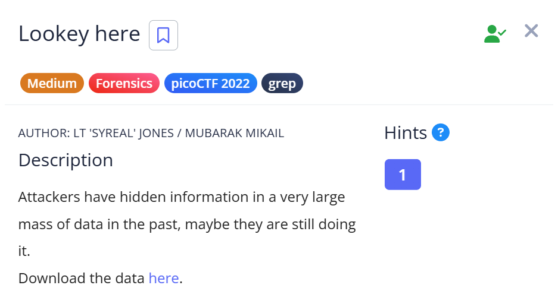
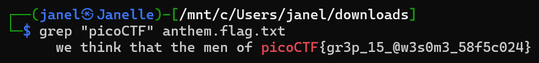

# 📝 Challenge Write-up: Lookey here

| Attribute | Details |
| :--- | :--- |
| **Event** | picoCTF 2022 |
| **Category** | Forensics |
| **Difficulty** | Medium |
| **Target File** | `anthem.flag.txt` |

## 1. The Challenge Scenario
The challenge description stated: "Attackers have hidden information in a very large mass of data in the past, maybe they are still doing it." We were provided with a massive text file full of data. The objective was to sift through thousands of words to find the hidden flag efficiently.



## 2. The Step-by-Step Solution
While standard text editors work for smaller files, I used this challenge to practice Kali Linux syntax for faster text parsing.

**Step 1:** I downloaded the target file, `anthem.flag.txt`, which contained a huge wall of text.

**Step 2:** Instead of opening it in Notepad and using `Ctrl + F`, I opened my Kali Linux terminal to interact with the file directly.

**Step 3:** I used the `grep` command to search the entire file specifically for the standard flag prefix. I ran the following command:

```bash
grep "picoCTF" anthem.flag.txt
```



**Step 4:** The terminal instantly filtered out all the unnecessary text and outputted the exact line containing the flag. 

## 3. The Findings
The command-line search was successful and immediately revealed the hidden flag:

```text
picoCTF{gr3p_15_@w3s0m3_58f5c024}
```

**Target Found:** `picoCTF{gr3p_15_@w3s0m3_58f5c024}`

## 4. Conclusion
This challenge was an excellent exercise in transitioning from GUI tools (like Notepad) to powerful command-line utilities. It demonstrated how quickly `grep` can parse massive amounts of data to find specific strings. Additionally, it highlighted a crucial difference in environments: unlike standard Notepad searches, `grep` is strictly **case-sensitive** by default, meaning the capitalization must be perfectly accurate to yield a result.
