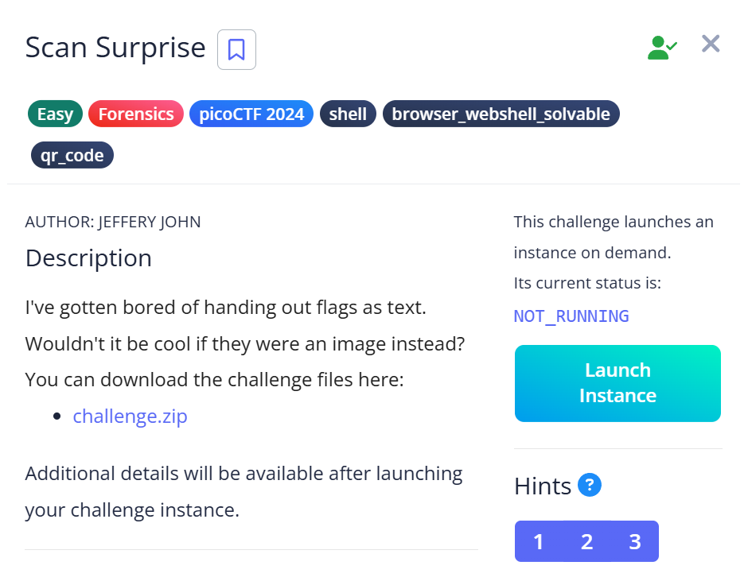
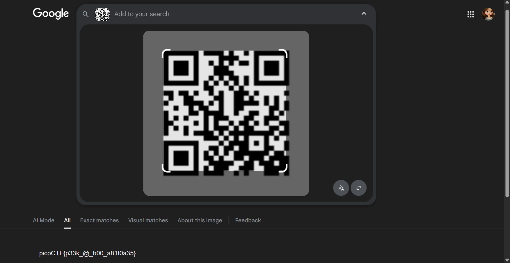

# 📝 Challenge Write-up: Scan Surprise

| Attribute | Details |
| :--- | :--- |
| **Event** | picoCTF 2024 |
| **Category** | Forensics / qr_code |
| **Difficulty** | Easy |
| **Target File** | `challenge.zip` |

## 1. The Challenge Scenario
A `challenge.zip` file was provided, along with a hint that the flag would be handed out as an image instead of standard text. The objective was to download the archive, locate the hidden image file within the extracted directories, and retrieve the flag from it. This required basic file extraction and QR code scanning.



## 2. The Step-by-Step Solution
This was a very straightforward challenge that required navigating an archive to find a visual payload.

**Step 1:** I downloaded the `challenge.zip` file provided in the challenge description. 

**Step 2:** I extracted the zip archive and navigated through the resulting subfolders until I located the target image file.

**Step 3:** Observing that the image was a standard QR code, I used a QR code scanner to scan the image and decode the hidden text payload. 



## 3. The Findings
The scan was successful and immediately revealed the hidden text containing the flag:

```text
picoCTF{p33k_@_b00_a81f0a35}
```

**Target Found:** `picoCTF{p33k_@_b00_a81f0a35}`

## 4. Conclusion
This task demonstrated a very simple method of data concealment. It showed that **QR codes** can be easily used to encode text payloads like CTF flags, and emphasized the fundamental skills of downloading, extracting archives, and navigating directory structures to locate target files.
