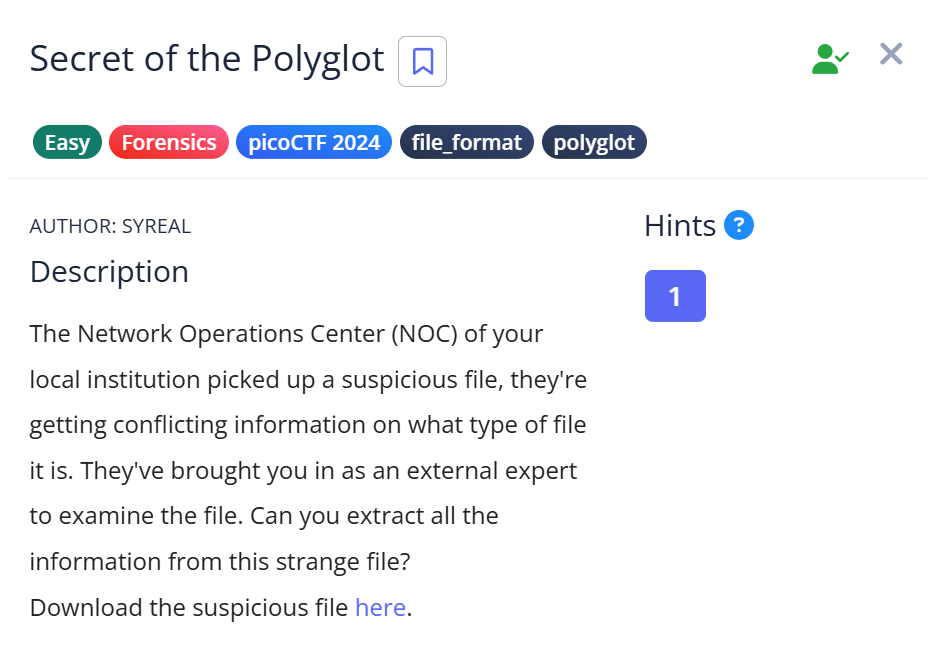
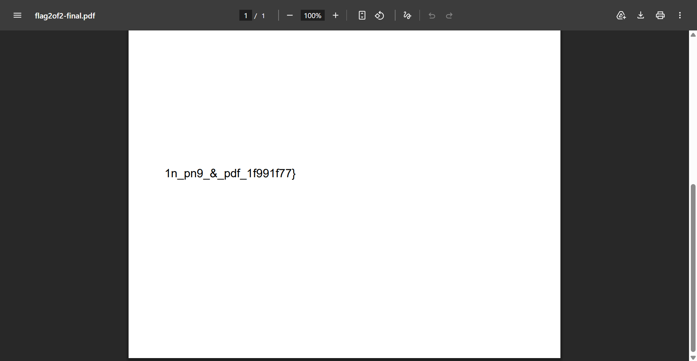
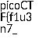

# 📝 Challenge Write-up: Secret of the Polyglot

| Attribute | Details |
| :--- | :--- |
| **Event** | picoCTF 2024 |
| **Category** | Forensics / file_format / polyglot |
| **Difficulty** | Easy |
| **Target File** | `suspicious_file` |

## 1. The Challenge Scenario
The Network Operations Center (NOC) picked up a suspicious file that presented conflicting information regarding its file type. The objective was to examine this strange file—acting as an external expert—and extract all hidden information from it.

## 2. The Step-by-Step Solution
This challenge required understanding how a single file can act as two different formats simultaneously.

**Step 1:** I downloaded the suspicious file and initially opened it as a PDF document. The document displayed a plain background containing the second half of the flag: `1n_pn9_&_pdf_1f991f77}`.

**Step 2:** To understand the "conflicting information" hint, I opened the file in Notepad to inspect its raw data. I immediately noticed a `PNG` header, indicating that the file also contained image data.

**Step 3:** Recognizing this as a polyglot file, I changed the file extension to `.png` and opened it in a standard image viewer. This successfully rendered the image portion of the file, which contained the first half of the flag: `picoCTF{f1u3n7_`.

## 3. The Findings
By treating the file as both a PDF and a PNG, I was able to retrieve both halves of the hidden payload and combine them to form the complete string.

* **Part 1 (from the PNG):** `picoCTF{f1u3n7_`
* **Part 2 (from the PDF):** `1n_pn9_&_pdf_1f991f77}`

**Target Found:** `picoCTF{f1u3n7_1n_pn9_&_pdf_1f991f77}`

## 4. Conclusion
This task demonstrated the concept of **polyglot files**—files that are perfectly valid in more than one format (in this case, PNG and PDF). It showed that simply relying on a file extension or a single viewer is not enough in forensics; inspecting the raw file headers is crucial for uncovering how different applications interpret the same data.
