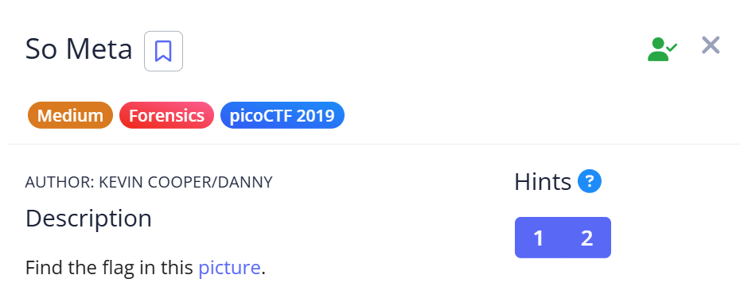
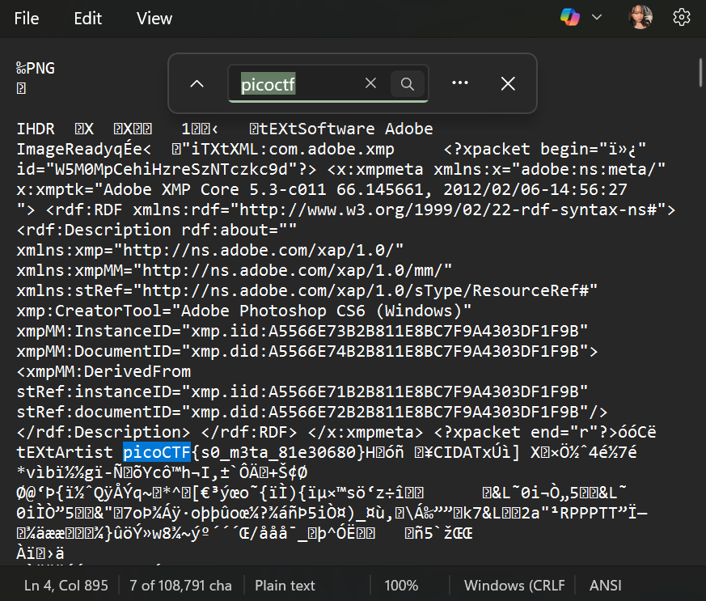

# 📝 Challenge Write-up: So Meta

| Attribute | Details |
| :--- | :--- |
| **Event** | picoCTF 2019 |
| **Category** | Forensics |
| **Difficulty** | Medium |
| **Target File** | `picture` |

## 1. The Challenge Scenario
We were given a straightforward instruction: "Find the flag in this picture." The objective was to analyze the provided image file to locate a hidden flag that wasn't visibly displayed when simply looking at the image normally.



## 2. The Step-by-Step Solution
This challenge can be solved quickly by inspecting the raw text data embedded within the image file.

**Step 1:** I downloaded the target file, which was an image named `picture`.

**Step 2:** Instead of opening the picture in a standard image viewer, I opened it directly using **Notepad**. This allowed me to view the raw data and expose any plain-text strings embedded within the file's binary structure or metadata.

**Step 3:** I used the built-in "Find" shortcut (`Ctrl + F`) and searched for the standard flag prefix: `picoCTF`.



**Step 4:** The search immediately jumped to the exact line containing the plain-text flag hidden among the surrounding image data.

## 3. The Findings
The basic text search was successful and revealed the hidden flag:

```text
picoCTF{s0_m3ta_81e30680}
```

**Target Found:** `picoCTF{s0_m3ta_81e30680}`

## 4. Conclusion
This task demonstrated that files like images contain more than just visual data; they often include metadata (like Exif data) or other hidden strings that are stored in plain text. While using Notepad and `Ctrl + F` works perfectly to uncover this, the challenge perfectly illustrates what "meta" means and serves as a great use case for tools like `exiftool` or the Linux `strings` command.
