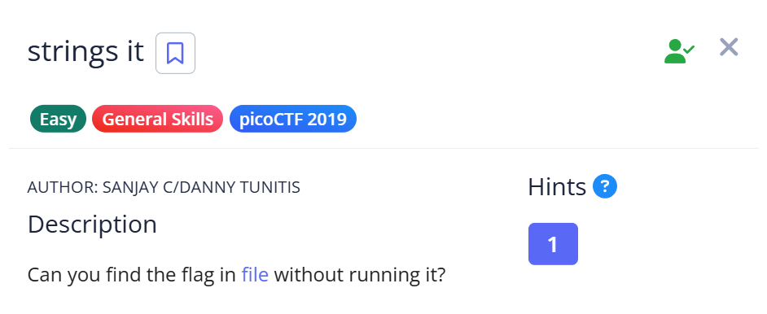
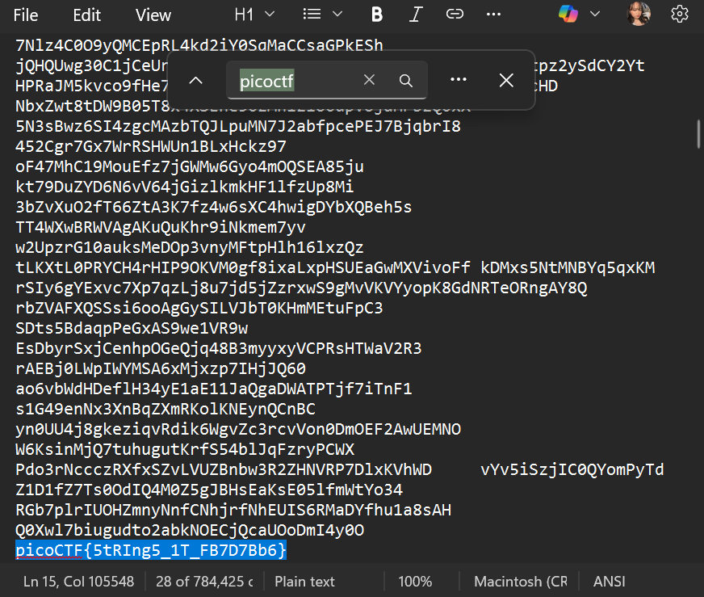

# 📝 Challenge Write-up: strings it

| Attribute | Details |
| :--- | :--- |
| **Event** | picoCTF 2019 |
| **Category** | General Skills |
| **Difficulty** | Easy |
| **Target File** | `file` |

## 1. The Challenge Scenario
A file was provided with a specific instruction: "Can you find the flag in file without running it?". The objective was to safely inspect the file's raw contents to extract the hidden flag without executing what could be a compiled binary.



## 2. The Step-by-Step Solution
This challenge can be solved quickly using a basic text editor to search for human-readable strings.

**Step 1:** I downloaded the target file provided in the challenge prompt.

**Step 2:** To avoid running the file, I opened it directly using **Notepad**. This allows viewing the raw data, exposing any plain-text strings embedded within the file's binary structure.

**Step 3:** I used the built-in "Find" shortcut (`Ctrl + F`) and searched for the standard flag prefix: `picoCTF`.



**Step 4:** The search immediately jumped to the exact line containing the plain-text flag among the surrounding data.

## 3. The Findings
The basic text search was successful and revealed the hidden flag:

```text
picoCTF{5tRIng5_1T_FB7D7Bb6}
```

**Target Found:** `picoCTF{5tRIng5_1T_FB7D7Bb6}`

## 4. Conclusion
This task demonstrated that you do not need to execute a file to see what text it contains. While using Notepad and `Ctrl + F` works perfectly, this challenge is explicitly designed to teach the use of the Linux `strings` command. The `strings` utility automatically extracts and prints all human-readable text from any binary or executable file, making it a foundational tool for reverse engineering and general CTF analysis.
