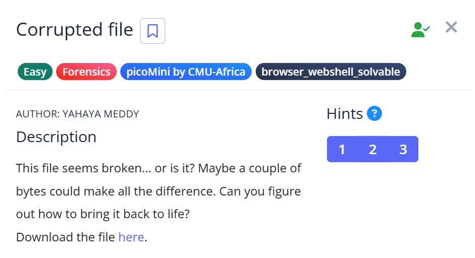

# 📝 Challenge Write-up: Corrupted file

| Attribute | Details |
| :--- | :--- |
| **Event** | picoMini by CMU-Africa |
| **Category** | Forensics |
| **Difficulty** | Easy |
| **Target File** | `file` |

## 1. The Challenge Scenario

A file named **`file`** was provided that appeared unusable because it had **no file extension**. Since the file type was unknown, it could not be opened normally.

The challenge description suggested that the file might seem broken, but that **a couple of bytes could make all the difference**, implying that the file might only need a small modification to be restored.

The objective was to determine the correct file format and recover the hidden flag.



## 2. The Step-by-Step Solution

To solve this challenge, I identified the correct file format and restored the file so it could be viewed normally.

**Step 1:** I examined the downloaded file and noticed that it was simply named:

```
file
```

The file had **no extension**, which meant the operating system could not determine how to open it.

Since the file size was small (around 9 KB), I suspected it might be a simple image file.

---

**Step 2:** To determine the actual file type, I opened the file using **Notepad**. At the very beginning of the file contents, I noticed the text:

```
JFIF
```

This is part of the **JFIF file header**, which indicates that the file is supposed to be a **JFIF image**. This gave a clear clue about the correct file format.

---

**Step 3:** Based on this information, I renamed the file to:

```
file.jfif
```

After changing the extension to **JFIF**, the file became viewable as an image.

---

**Step 4:** I opened the restored image file and saw a **plain background image containing red text**, which displayed the flag directly.

This confirmed that the file was not truly corrupted — it only needed the correct format to be recognized.

---

## 3. The Findings

After restoring the file and opening the image, the flag was revealed:

```text
picoCTF{r3st0r1ng_th3_by73s_b67c1558}
```

**Target Found:** `picoCTF{r3st0r1ng_th3_by73s_b67c1558}`

---

## 4. Conclusion

This challenge demonstrated how files can appear corrupted when they are simply **missing their proper format information**.

By inspecting the file contents using a text editor, it was possible to identify the **JFIF file signature**, which revealed the correct file type. Assigning the proper extension allowed the file to be opened successfully.

This challenge highlights the importance of checking file headers when dealing with seemingly corrupted files, since a few bytes can reveal the true format of a file.
