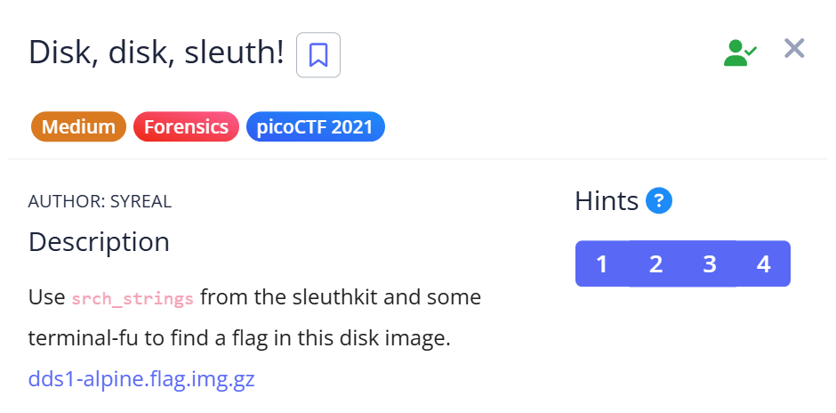
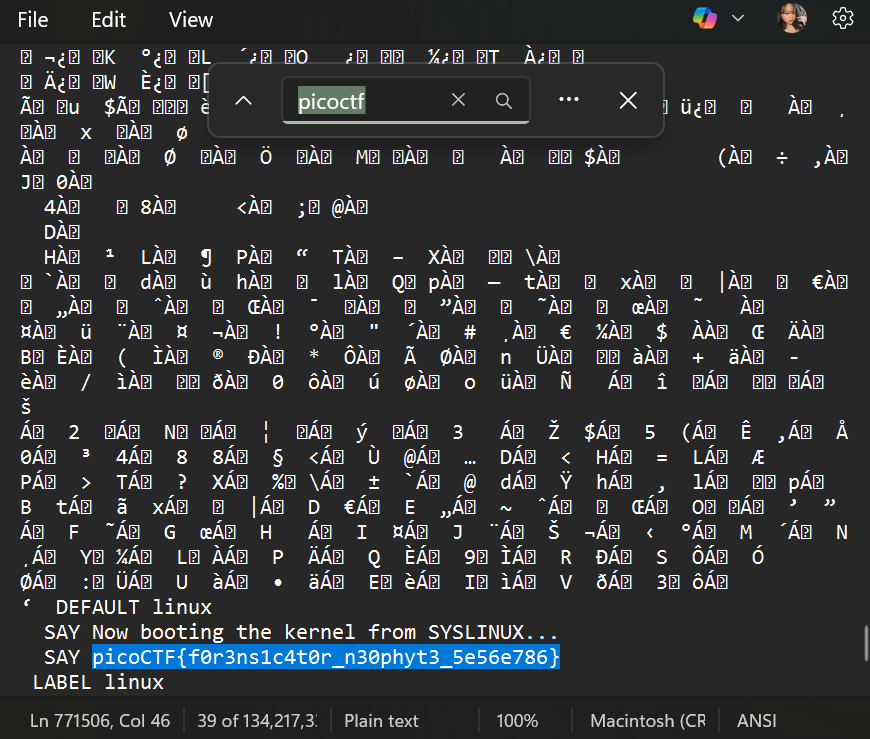

# 📝 Challenge Write-up: Forensics Neophyte

| Attribute | Details |
| :--- | :--- |
| **Event** | picoCTF |
| **Category** | Forensics |
| **Difficulty** | Medium |
| **Target File** | `target_file` |

## 1. The Challenge Scenario
We were provided with a file to analyze for a hidden flag. However, attempting to open or execute the file normally resulted in Windows blocking the action, likely due to security mechanisms flagging the unknown or potentially suspicious file format. The objective was to find a safe way to inspect the file's contents and extract the flag.



## 2. The Step-by-Step Solution
To solve this challenge safely without executing the file or triggering Windows Defender, I used a basic text editor to inspect the raw data.

**Step 1:** I downloaded the target file provided in the challenge prompt.

**Step 2:** Because Windows blocked the file from opening normally, I bypassed the OS restrictions by opening the file directly in **Notepad**. This allowed me to safely view the raw binary and text data of the file without running any potentially executable code.

**Step 3:** Knowing that the flag follows a standard format, I used the built-in "Find" shortcut (`Ctrl + F`) to search the raw data for the string: `picoCTF`.



**Step 4:** The search successfully jumped straight to the plain-text flag embedded within the otherwise unreadable file data.

## 3. The Findings
The simple text-search method successfully bypassed the OS block and revealed the hidden flag:

```text
picoCTF{f0r3ns1c4t0r_n30phyt3_5e56e786}
```

**Target Found:** `picoCTF{f0r3ns1c4t0r_n30phyt3_5e56e786}`

## 4. Conclusion
This challenge reinforces a crucial lesson in digital forensics: you should never execute a suspicious or unknown file. When an operating system like Windows blocks a file, opening it in a raw text editor (like Notepad) or using command-line tools (like `strings`) is the safest way to perform initial static analysis. Text editors only read the file's data—they don't execute its instructions—allowing you to safely discover hidden strings and flags.
