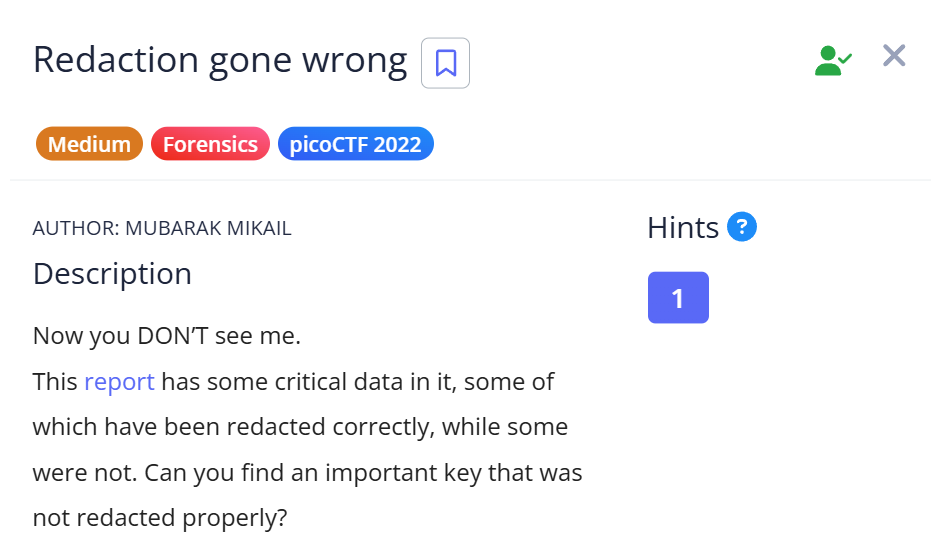
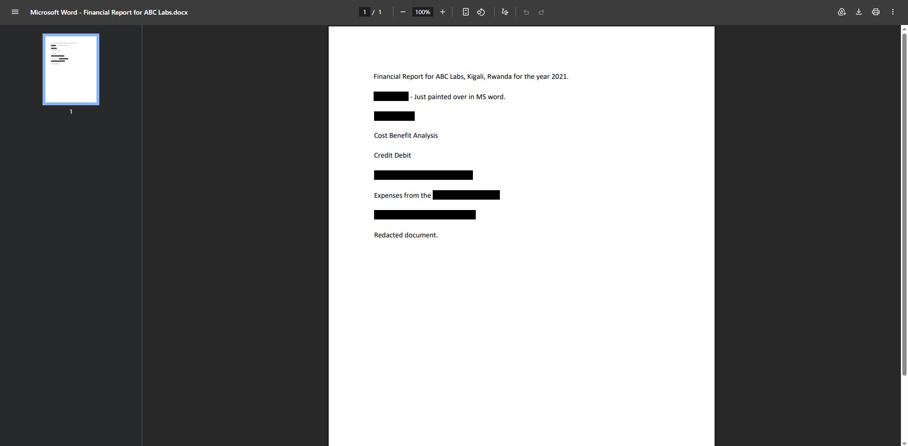
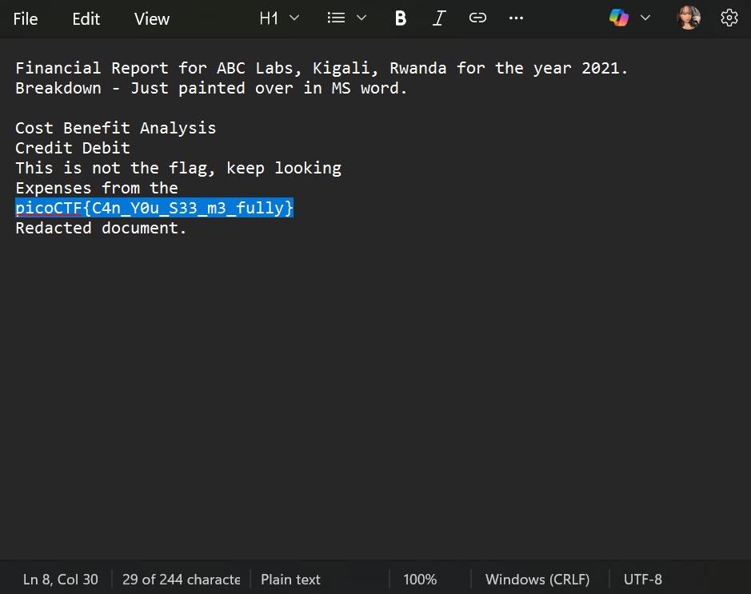

# 📝 Challenge Write-up: Redaction gone wrong

| Attribute | Details |
| :--- | :--- |
| **Event** | picoCTF 2022 |
| **Category** | Forensics |
| **Difficulty** | Medium |
| **Target File** | Downloaded PDF Report |

## 1. The Challenge Scenario
The challenge provided a report containing critical data, explaining that while some information was redacted correctly, other parts were not. The objective was to find an important key that failed to be properly redacted, playing on the hint, "Now you DON'T see me".



## 2. The Step-by-Step Solution
To solve this, I relied on a simple extraction technique to uncover text hidden beneath visual layers.

**Step 1:** I downloaded the challenge file and opened the PDF. Upon inspection, I noticed several lines of text that appeared to be redacted with black highlighting.



**Step 2:** Knowing that sometimes digital redaction is merely a visual overlay rather than actual data removal, I used `Ctrl + A` to highlight and select all the text contents inside the PDF document.

**Step 3:** I copied the selected data and pasted it directly into a basic text editor (Notepad).

**Step 4:** Stripping away the PDF's visual formatting by pasting it into Notepad revealed the raw text, exposing the hidden flag that was visually covered by the black redaction blocks.



## 3. The Findings
Bypassing the flawed visual redaction successfully revealed the hidden text:

```text
picoCTF{C4n_Y0u_S33_m3_fully}
```

**Target Found:** `picoCTF{C4n_Y0u_S33_m3_fully}`

## 4. Conclusion
This task demonstrated a common pitfall in digital document security. Drawing a black box over text in a PDF often only masks the text visually, leaving the underlying textual data entirely intact and easily extractable via a simple copy-paste operation. Proper redaction requires completely removing the data from the file, not just covering it up.
