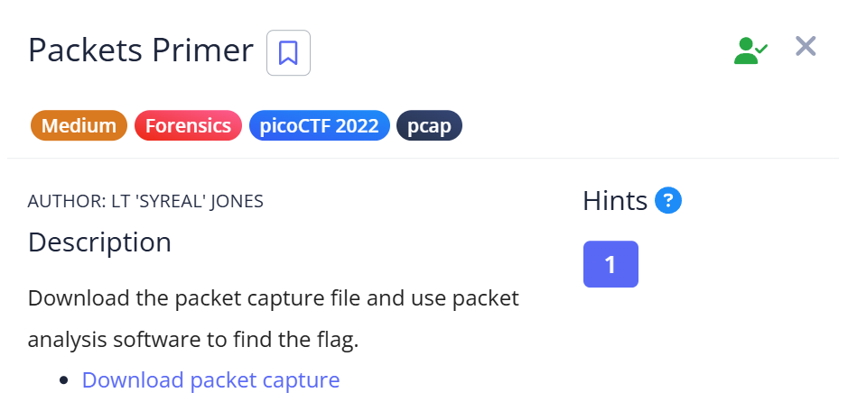
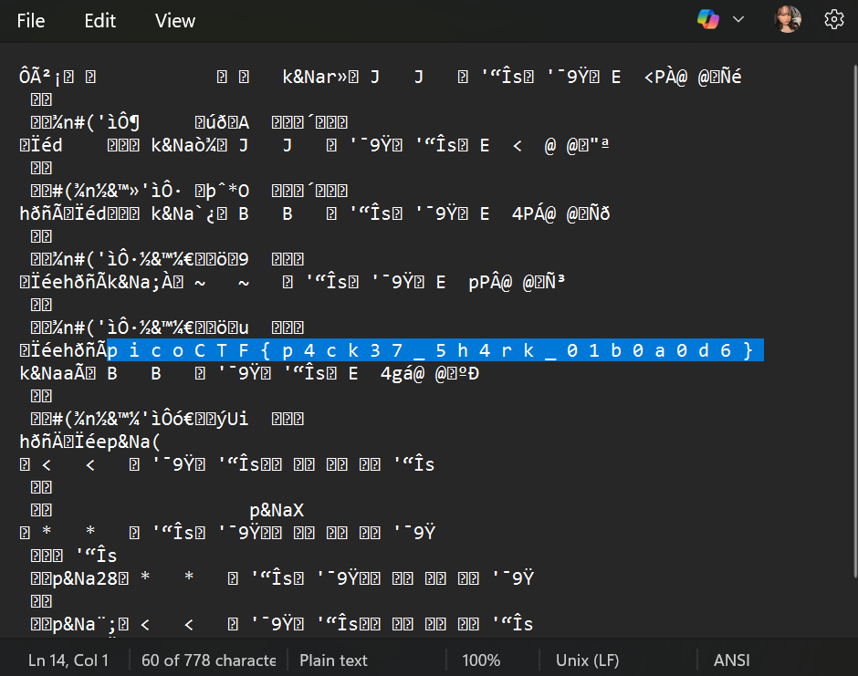

# 📝 Challenge Write-up: Packets Primer

| Attribute | Details |
| :--- | :--- |
| **Event** | picoCTF 2022 |
| **Category** | Forensics |
| **Difficulty** | Medium |
| **Target File** | Downloaded PCAP File |

## 1. The Challenge Scenario
The challenge provided a packet capture file and instructed the user to use packet analysis software to locate the hidden flag. The challenge was categorized under Forensics and included a "pcap" tag.



## 2. The Step-by-Step Solution
Instead of setting up a dedicated packet analyzer like Wireshark, I opted for a quick static analysis approach to see if the flag was sent in plain text.

**Step 1:** I downloaded the provided packet capture file to my local machine.

**Step 2:** Bypassing the suggested protocol analysis tools, I opened the file directly using a standard text editor (Notepad). 

**Step 3:** By scrolling through the raw text output, I was able to immediately spot the code hidden within the unencrypted packet data.



## 3. The Findings
Opening the file in a text editor successfully revealed the plain text flag without needing to parse the network protocols. 

```text
[picoCTF{p4ck37_5h4rk_01b0a0d6}]
```

**Target Found:** `[picoCTF{p4ck37_5h4rk_01b0a0d6}]`

## 4. Conclusion
This task demonstrated that while packet capture (.pcap) files are designed to be read by specialized software, the underlying data they contain is often just unencrypted text. If a flag is transmitted over an unencrypted protocol, a simple text editor or command-line tool (like `strings`) is often all it takes to extract the payload quickly, proving that sometimes the simplest tool is the most efficient.
