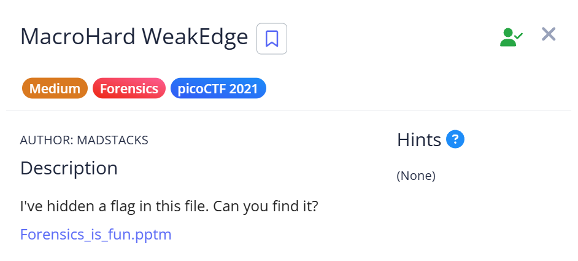
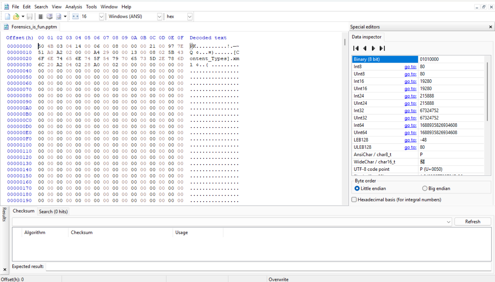

# 📝 Challenge Write-up: MacroHard WeakEdge

| Attribute | Details |
| :--- | :--- |
| **Event** | picoCTF 2021 |
| **Category** | Forensics |
| **Difficulty** | Medium |
| **Target File** | `Forensics_is_fun.pptm` |

## 1. The Challenge Scenario
A presentation file (`Forensics_is_fun.pptm`) was provided that supposedly contained a hidden flag. Opening the file normally only revealed plain slides with some small, nonsensical text. The objective was to dig deeper into the file's structure to uncover the concealed payload.



## 2. The Step-by-Step Solution
To solve this challenge, I analyzed the file's magic bytes and treated the presentation file as a compressed archive to access its internal components.

**Step 1:** I initially opened the presentation file normally, but found no obvious flag.

**Step 2:** To inspect the raw data, I opened the file using the **HxD** hex editor. I immediately noticed the `PK` header (`50 4B 03 04`) at the very beginning, which is the standard file signature for a ZIP archive.



**Step 3:** Knowing that modern presentation files are basically just specialized archives, I renamed the file extension from `.pptm` to **`.zip`** and extracted all the contents.

**Step 4:** I explored the resulting subfolders. Deep inside the directory structure, specifically within the `ppt/slideMasters` folder, I discovered an unusual file named simply `hidden`.

**Step 5:** I opened the `hidden` file and found a string of text with spaces inserted between the characters. Recognizing this as obfuscated Base64, I removed all the spaces to reconstruct the clean string:

```text
ZmxhZzogcGljb0NURntEMWRfdV9rbjB3X3BwdHNfcl96MXA1fQ
```

**Step 6:** I pasted the cleaned Base64 string into **DevToys** to decode it, which successfully translated the text into the final plain-text flag.

## 3. The Findings
Decoding the hidden Base64 string successfully revealed the flag:

```text
flag: picoCTF{D1d_u_kn0w_ppts_r_z1p5}
```

**Target Found:** `picoCTF{D1d_u_kn0w_ppts_r_z1p5}`

## 4. Conclusion
This challenge is an excellent demonstration of how modern Microsoft Office documents (like `.pptx`, `.pptm`, `.docx`) are actually structured. They are essentially ZIP archives containing various XML files, media, and folders. By verifying the `PK` header in a hex editor like HxD and changing the extension to `.zip`, you can easily unpack the document and find hidden files or data that aren't visible when viewing the presentation normally.
