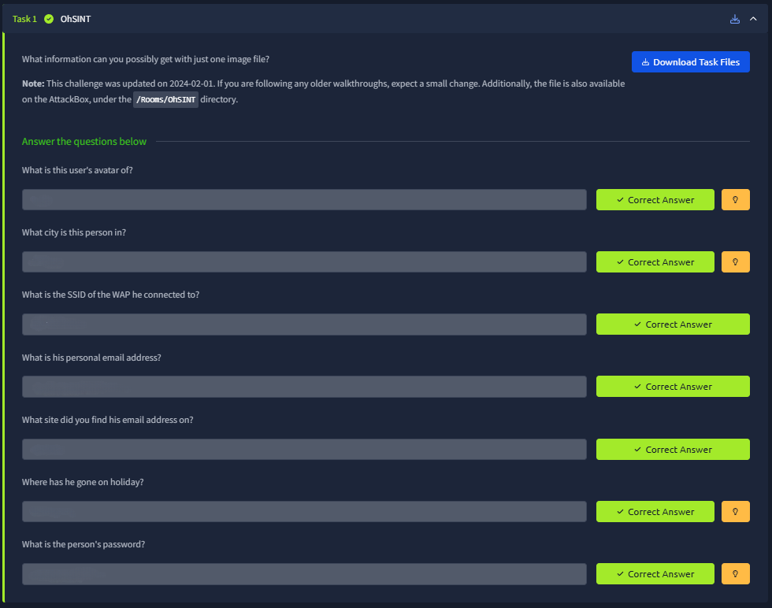
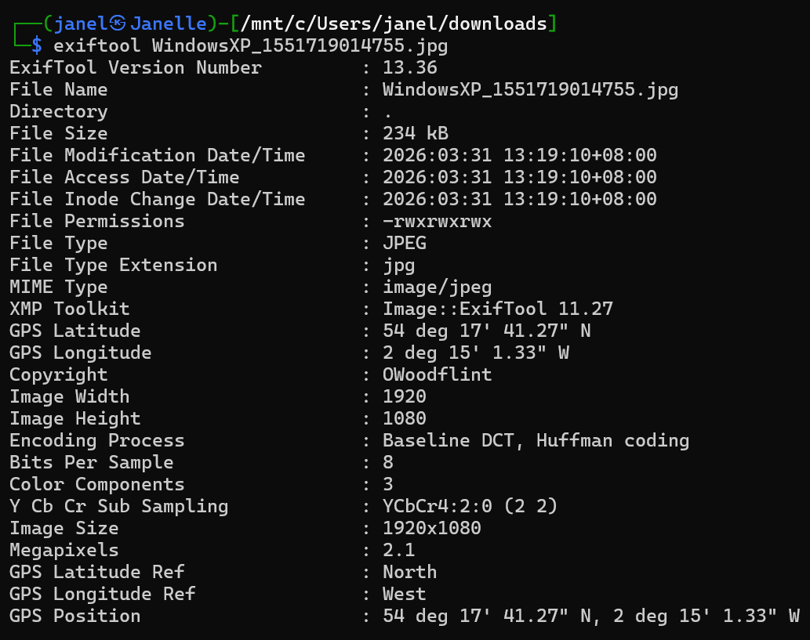
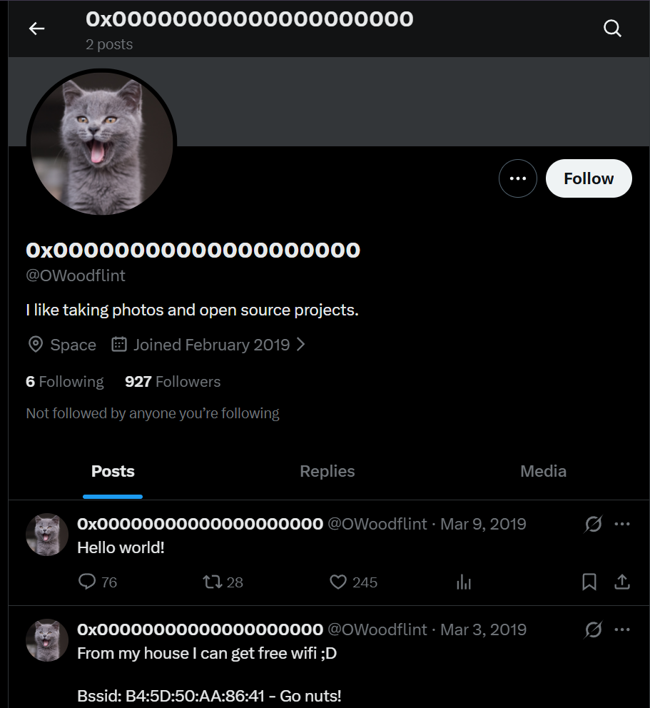
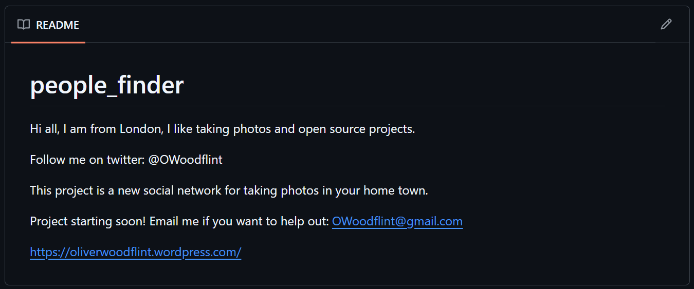
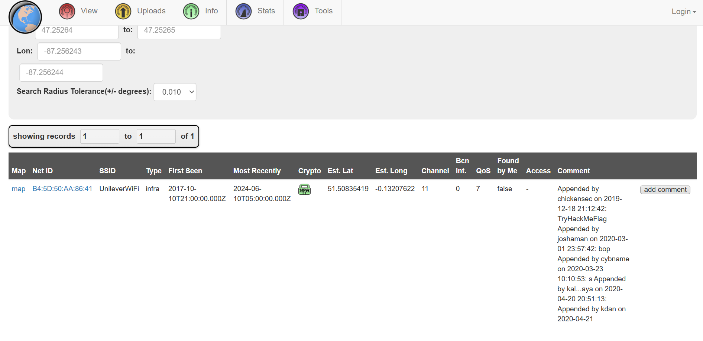
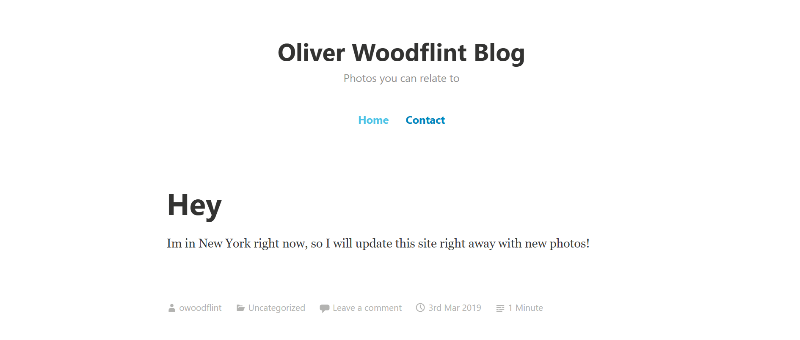
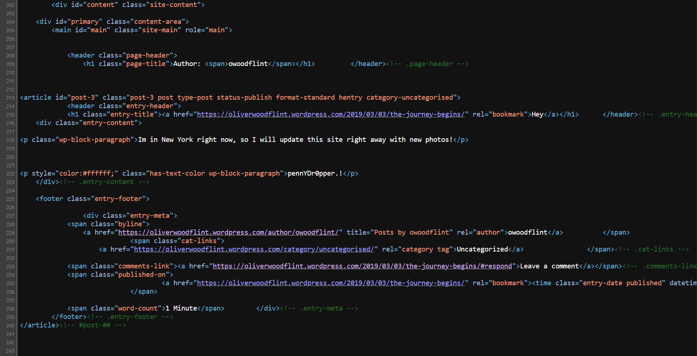

# 📝 Challenge Write-up: OhSINT

| Attribute | Details |
| :--- | :--- |
| **Event** | TryHackMe |
| **Category** | OSINT |
| **Difficulty** | Easy |
| **Target File** | `WindowsXP_1551719014755.jpg` |

## 1. The Challenge Scenario
The challenge provided a single image file and asked a simple question: "What information can you possibly get with just one image file?" The objective was to use Open-Source Intelligence (OSINT) techniques to track down a specific user's online footprint, uncovering their location, email, wireless network, and password based entirely on the metadata left behind in the provided photo.

## 2. The Step-by-Step Solution
To solve this, the investigation had to move from local metadata extraction to public web enumeration, linking various social media and development profiles together.

**Step 1: Extracting Metadata**
I began by downloading the provided image (`WindowsXP_1551719014755.jpg`) and running `exiftool` on Kali Linux to parse its hidden data. Scanning the output, I found a clear breadcrumb left in the copyright tag: `OWoodflint`.

**Step 2: Social Media Enumeration (Avatar & BSSID)**
I searched Google for the username `OWoodflint` and found a Twitter/X profile. Looking at the profile, the user's avatar is clearly a **cat**. Additionally, one of the tweets stated, "From my house I can get free wifi ;D" and provided a BSSID: `B4:5D:50:AA:86:41`. 

**Step 3: Finding the City & Email (GitHub)**
Continuing the Google search for `OWoodflint` led to a GitHub repository named `people_finder`. Reading the `README.md` file in this repository instantly answered several questions. The first line explicitly states, "Hi all, I am from **London**," which solves the mystery of where the city name came from. Further down the document, the user provides their personal email: **OWoodflint@gmail.com**. Both of these details were hosted on **Github**.

**Step 4: Tracking the Wireless Access Point (WiGLE)**
Taking the BSSID (`B4:5D:50:AA:86:41`) found on Twitter, I navigated to WiGLE.net (a database of wireless networks). I input the BSSID into the basic search parameters. The database returned a hit, revealing the SSID of the WAP he connected to is **UnileverWiFi**.

**Step 5: Locating the Holiday Destination (WordPress)**
The GitHub README also provided a link to a personal blog: `oliverwoodflint.wordpress.com`. Visiting the site, the main post titled "Hey" simply reads, "Im in **New York** right now, so I will update this site right away with new photos!" This confirmed his holiday destination.

**Step 6: Uncovering the Password (Source Code Inspection)**
While on the WordPress blog, there didn't appear to be any other visible information. However, right-clicking the page and selecting "View Page Source" (or inspecting the elements) revealed a hidden paragraph block. The text was formatted to be the exact same color as the background (`color:#ffffff;`), hiding the string **pennYDr0pper.!**. This was his password.

## 3. The Findings
By chaining together the clues left across different platforms, all challenge questions were successfully answered:

* **What is this user's avatar of?** `cat`
* **What city is this person in?** `London`
* **What is the SSID of the WAP he connected to?** `UnileverWiFi`
* **What is his personal email address?** `OWoodflint@gmail.com`
* **What site did you find his email address on?** `Github`
* **Where has he gone on holiday?** `New York`
* **What is the person's password?** `pennYDr0pper.!`

## 4. Conclusion
This challenge thoroughly demonstrated the cascading nature of OSINT. A single piece of metadata (a copyright name inside an image) acted as a pivot point that exposed a Twitter account, a GitHub repository, and a personal blog. It also highlighted the importance of checking beyond surface-level information, such as querying physical network locations via WiGLE and inspecting web page source code for hidden text formatting.
