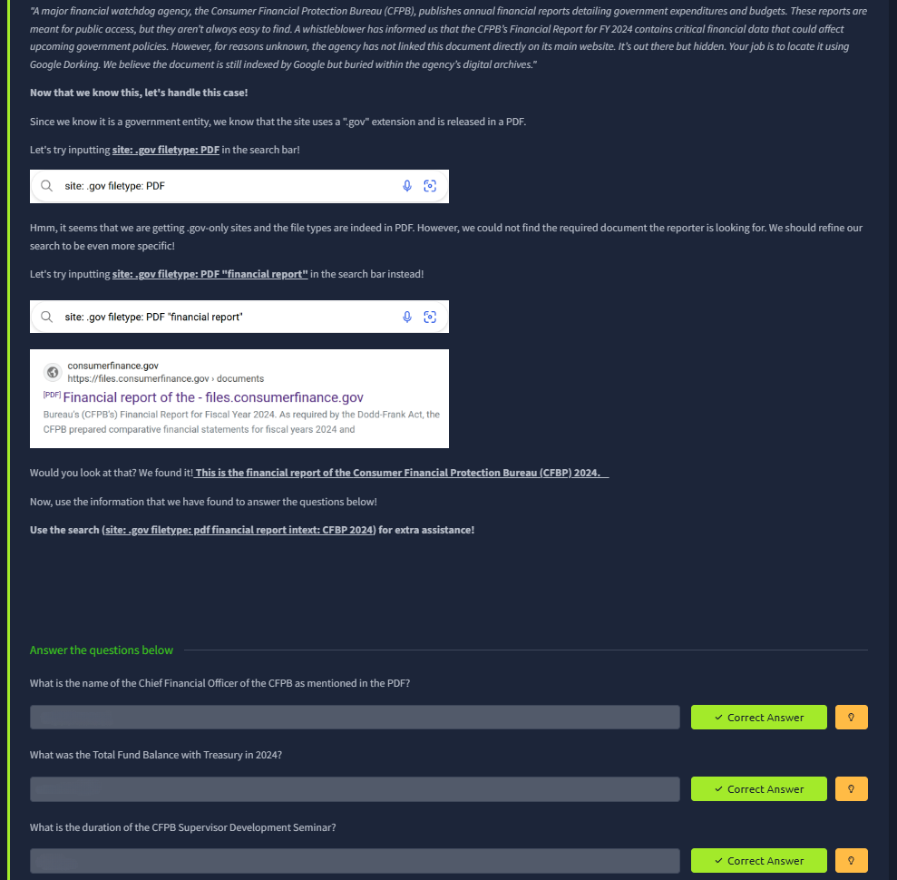
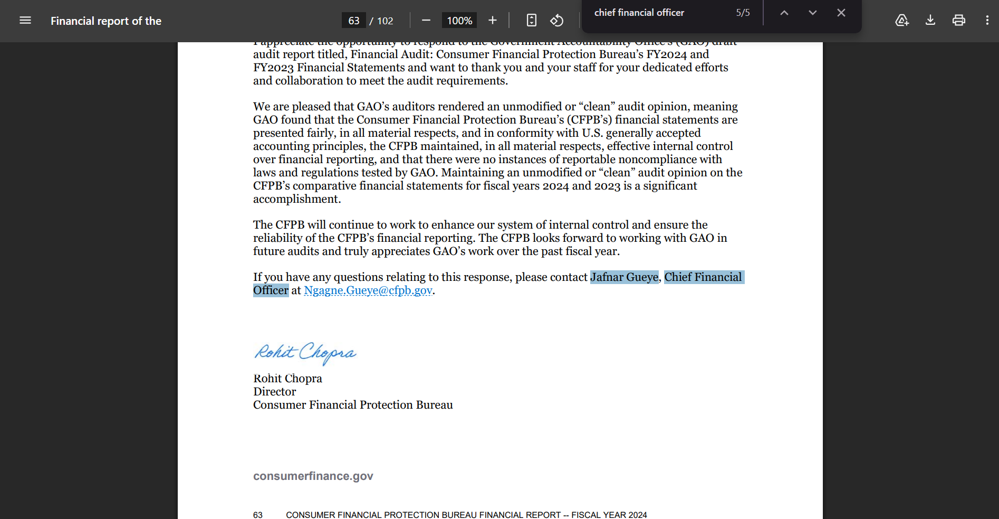
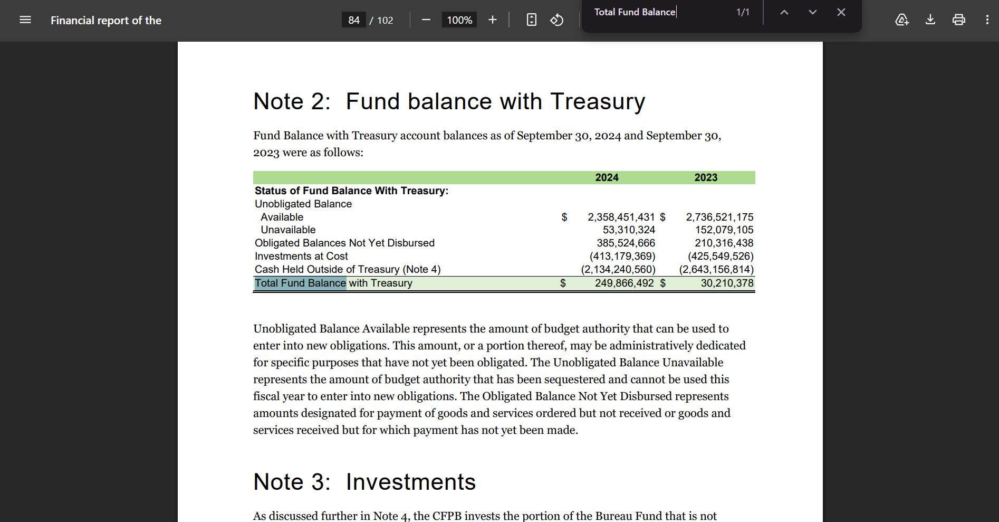
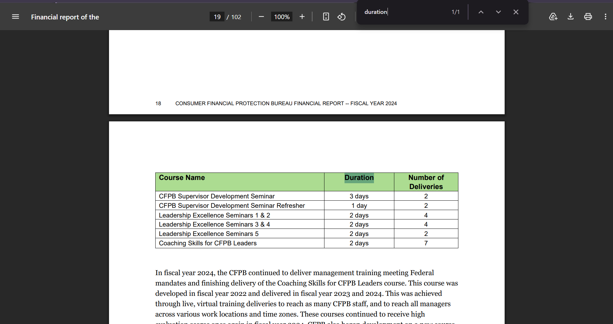

# 📝 Challenge Write-up: OSINT Level 1 (Task 2)

| Attribute | Details |
| :--- | :--- |
| **Event** | TryHackMe |
| **Category** | OSINT / Google Dorking |
| **Difficulty** | Easy |
| **Target File** | `cfpb_financial-report-fy-2024.pdf` |

## 1. The Challenge Scenario
Task 2 introduces the concept of **Google Dorking** (using advanced search operators). The scenario involves acting on a whistleblower's tip about a hidden, unlinked financial report for the Consumer Financial Protection Bureau (CFPB) for FY 2024. The objective was to use specific search operators to force Google to reveal the buried PDF and then parse that massive document for highly specific financial and operational trivia.

## 2. The Step-by-Step Solution
This challenge effectively demonstrated how to combine search engine operators to find hidden files, followed by targeted keyword searching to parse large datasets. 

**Step 1: Locating the Hidden PDF (Google Dorking)**
Knowing the target was a U.S. government agency and the file was a PDF, standard search queries wouldn't be enough. By combining operators—`site:.gov` (to restrict results to government domains), `filetype:pdf` (to only return PDF documents), and exact match strings like `"financial report"`—the exact unlinked file (`cfpb_financial-report-fy-2024.pdf`) was successfully extracted from Google's index.

**Step 2: Parsing for the CFO (Ctrl+F)**
Once the 102-page PDF was opened, reading it top-to-bottom would be incredibly inefficient. I used the document search function (`Ctrl+F`) and queried the exact phrase "Chief Financial Officer". This immediately jumped to page 63, where a formal response letter explicitly directed any questions to **Jafnar Gueye**, the Chief Financial Officer.

**Step 3: Extracting Financial Data**
Next, I needed to find the Total Fund Balance for 2024. Using `Ctrl+F` again, I searched for the phrase "Total Fund Balance". This jumped directly to "Note 2: Fund balance with Treasury" on page 84. Looking at the table under the 2024 column, the exact numeric value was **$249,866,492**. (To match the flag format, the commas and dollar sign were stripped out).

**Step 4: Extracting Operational Data**
For the final question regarding the "CFPB Supervisor Development Seminar," I used `Ctrl+F` to search for the word "duration" or the specific course name. This located a management training table on page 19. The table clearly listed the target seminar alongside its corresponding duration of **3 days**.

*(Note: During this investigation, some unrelated searches regarding Intel's CEO were conducted, but these were successfully filtered out as out-of-scope intelligence!)*

## 3. The Findings
By utilizing Google Dorking to find the file and strict keyword searching to navigate it, all three flags were secured:

* **What is the name of the Chief Financial Officer of the CFPB as mentioned in the PDF?** `Jafnar Gueye`
* **What was the Total Fund Balance with Treasury in 2024?** `249866492`
* **What is the duration of the CFPB Supervisor Development Seminar?** `3 days`

## 4. Conclusion
This task was a highly practical exercise in digital forensics and OSINT. It proved that simply because an organization removes a link from their main website, the document is not actually secure; if it is hosted on the server, Google Dorks like `site:` and `filetype:` will easily unearth it. Furthermore, it reinforced the absolute necessity of utilizing `Ctrl+F` keyword searching rather than manual reading when analyzing massive, 100+ page corporate or government documents.
