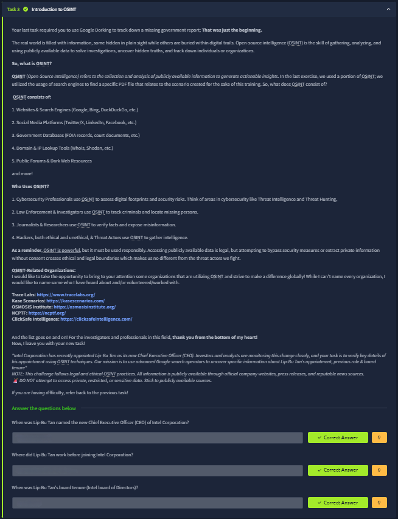
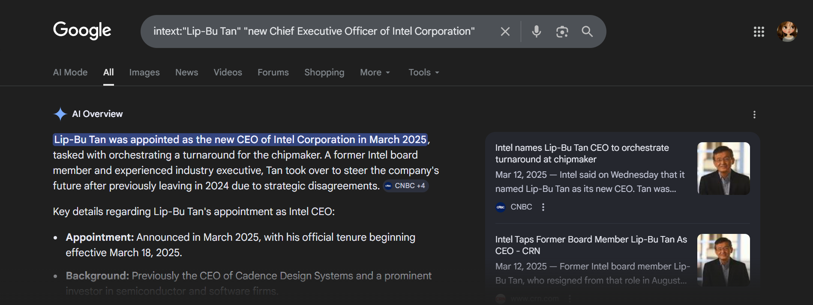
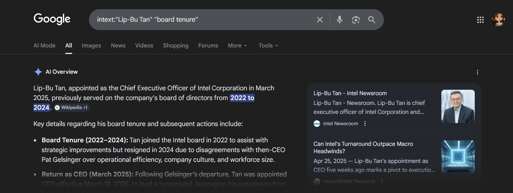

# 📝 Challenge Write-up: OSINT Level 1 (Task 3)

| Attribute | Details |
| :--- | :--- |
| **Event** | TryHackMe |
| **Category** | OSINT / Search Engine Reconnaissance |
| **Difficulty** | Easy |
| **Target Subject** | Corporate Executive OSINT (Lip-Bu Tan) |

## 1. The Challenge Scenario
Task 3 ("Introduction to OSINT") transitions from searching for hidden government documents to verifying corporate intelligence using public news sources. The objective was to use Google Dorking techniques to uncover specific details regarding Intel Corporation's recent appointment of Lip-Bu Tan as their new Chief Executive Officer, including his start date, previous employer, and historical board tenure.

## 2. The Step-by-Step Solution
This challenge demonstrated how to use exact-match phrasing and the `intext:` operator to quickly filter out irrelevant news articles and zero in on specific biographical data.

**Step 1: Discovering the Appointment Date & Previous Employer**
To find exactly when he was appointed and where he worked prior, I used a targeted Google query combining the `intext:` operator with exact phrase matching: `intext:"Lip-Bu Tan" "new Chief Executive Officer of Intel Corporation"`. 
The AI Overview and resulting financial news snippets quickly summarized the key details: while the announcement was made earlier, his official tenure began on **March 18, 2025**. Furthermore, the background section confirmed he was previously the CEO of **Cadence Design Systems**.

**Step 2: Uncovering Past Board Tenure**
To answer the final question regarding his historical involvement with Intel's board, I adjusted the search query to target that specific metric: `intext:"Lip-Bu Tan" "board tenure"`. 
The search results successfully extracted the timeline, confirming that he previously served on the company's board of directors from **2022 to 2024** (formatted as `2022 2024` for the TryHackMe flag submission) before resigning due to strategic disagreements and later returning as CEO.

## 3. The Findings
By leveraging strict search operators to parse recent corporate news, all three flags were successfully retrieved:

* **When was Lip-Bu Tan named the new Chief Executive Officer (CEO) of Intel Corporation?** `March 18, 2025`
* **Where did Lip-Bu Tan work before joining Intel Corporation?** `Cadence Design Systems`
* **When was Lip-Bu Tan's board tenure (Intel board of Directors)?** `2022 2024`

## 4. Conclusion
This task served as a practical introduction to corporate OSINT. It highlighted the importance of the `intext:` operator and quotation marks when hunting for executive intelligence. Instead of manually reading through dozens of lengthy press releases, news articles, or Wikipedia pages, using targeted dorks forces the search engine to extract and summarize the exact biographical timelines required for an investigation.
