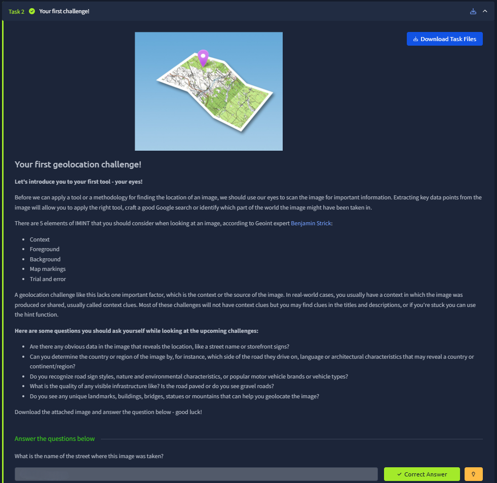

# 📝 Challenge Write-up: Searchlight - IMINT (Task 2)

| Attribute | Details |
| :--- | :--- |
| **Event** | TryHackMe |
| **Category** | IMINT / OSINT |
| **Difficulty** | Easy |
| **Target File** | `task2_1602089234031.jpg` |

## 1. The Challenge Scenario
This challenge serves as an introduction to Image Intelligence (IMINT) within the Searchlight room. The objective was simply to identify the name of the street where the provided image was taken. The scenario emphasized using your own eyes to scan the image for obvious elements like context, foreground, background, and text before relying on advanced tools.

## 2. The Step-by-Step Solution
As you accurately pointed out, this specific challenge was extremely straightforward because the answer was practically handed to us in plain sight.

**Step 1: Visual Inspection**
I downloaded the target file (`task2_1602089234031.jpg`) and opened it to perform a basic visual scan. Following the challenge's advice to look for "obvious data in the image that reveals the location," I immediately scanned the foreground and background for signs or readable text.

**Step 2: Identifying the Clue**
Right in the dead center of the photograph, suspended above the bustling pedestrian area, is a massive, unmistakable archway sign. 

**Step 3: Extracting the Answer**
The text on the archway clearly reads: **"WELCOME TO CARNABY STREET"**. There was no need to perform reverse image searches, scrutinize the architecture, or extract EXIF metadata because the primary visual clue provided the exact street name required. I simply took the street name and wrapped it in the platform's required flag format.

## 3. The Findings
By utilizing basic visual observation, the street name was immediately identified without the need for external tools.

* **What is the name of the street where this image was taken?** `sl{carnaby street}`

## 4. Conclusion
This task perfectly demonstrated the absolute first rule of IMINT (Image Intelligence): always start with your eyes. Before diving into complex geolocation tools, metadata extraction, or reverse image searching, simply scanning an image for obvious storefront signs, street markers, or prominent text will often yield the answer in seconds.
