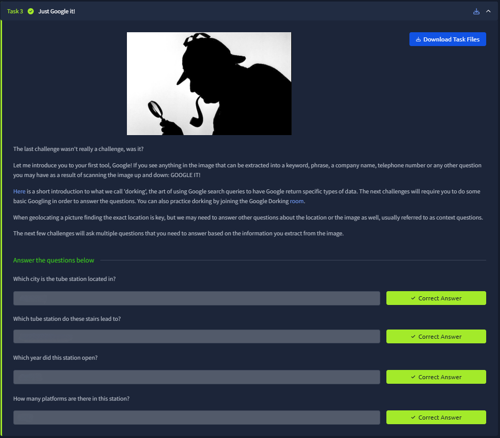
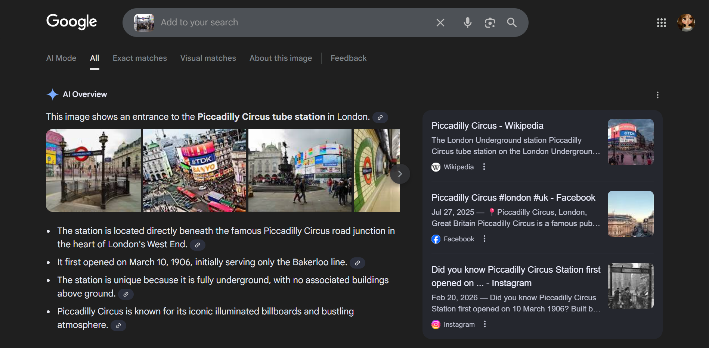
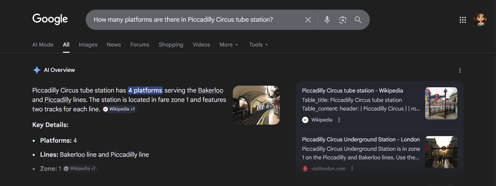

# 📝 Challenge Write-up: Searchlight - IMINT (Task 3)

| Attribute | Details |
| :--- | :--- |
| **Event** | TryHackMe |
| **Category** | IMINT / OSINT |
| **Difficulty** | Easy |
| **Target File** | Task 3 Image (Subway Entrance) |

## 1. The Challenge Scenario
Following the visual analysis in Task 2, Task 3 ("Just Google it!") introduces the concept of using search engines and Google Dorking to extract contextual information. The objective was to not only identify the location of the provided image but to answer specific historical and structural trivia questions about that location.

## 2. The Step-by-Step Solution
By following a combination of reverse image searching and direct keyword querying, gathering the required context was quick and straightforward.

**Step 1: Reverse Image Search**
I started by taking the provided image of the subway stairs and running it through Google Lens / Google Image Search. The search engine immediately recognized the architecture and signs, identifying the location as the **Piccadilly Circus tube station**. The AI Overview and Wikipedia snippets confirmed that the station is located in **London** and originally opened in **1906**. This single search answered the first three questions.

**Step 2: Direct Keyword Query**
To find the structural details of the station, I took the name discovered in Step 1 and performed a direct Google search for the specific question: *"How many platforms are there in Piccadilly Circus tube station?"* The AI Overview and highlighted search results quickly confirmed that the station operates with **4 platforms** (serving the Bakerloo and Piccadilly lines).

*(Note: The additional searches for "YVR CONNECTS" and "Vancouver International Airport" were excellent preemptive OSINT steps for the subsequent Task 4 challenge!)*

## 3. The Findings
Using Google to extract secondary information from the primary image yielded all the necessary flags:

* **Which city is the tube station located in?** `sl{london}`
* **Which tube station do these stairs lead to?** `sl{piccadilly circus}`
* **Which year did this station open?** `sl{1906}`
* **How many platforms are there in this station?** `sl{4}`

## 4. Conclusion
This task effectively demonstrated that locating an image is often just the first step in an OSINT investigation. Once a physical location is identified via visual matches or reverse image searching, standard search engine queries (and Google Dorking) are essential for gathering the deeper contextual intelligence—such as historical dates, structural blueprints, and associated organizations—required to fully profile a target.
