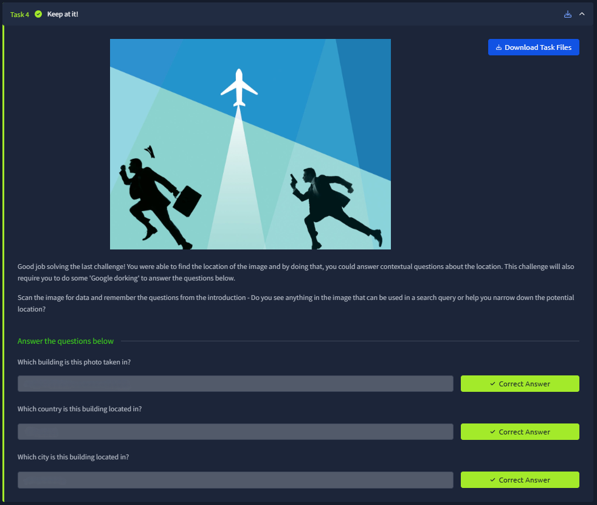
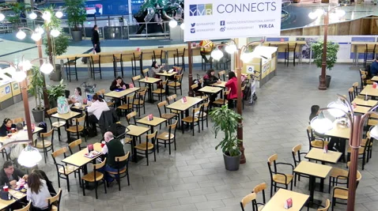
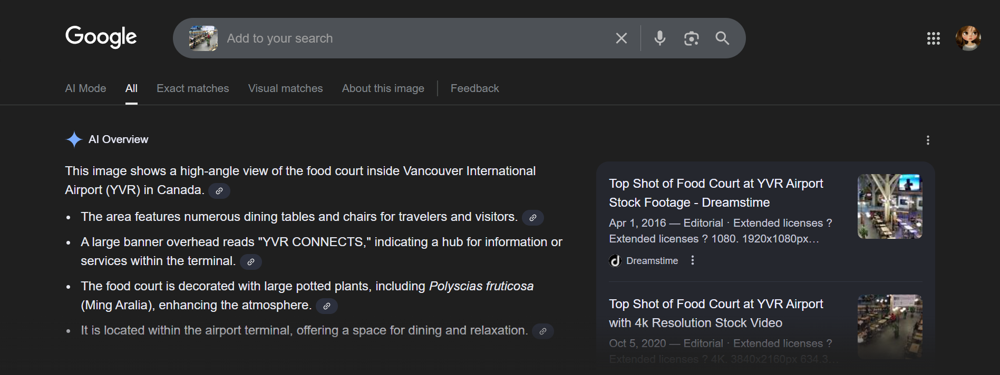
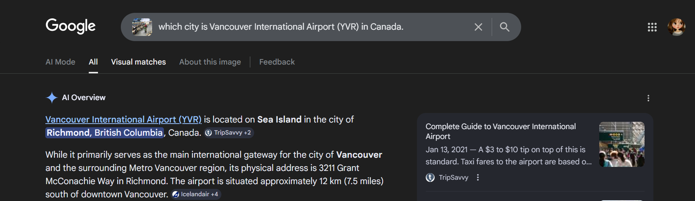

# 📝 Challenge Write-up: Searchlight - IMINT (Task 4)

| Attribute | Details |
| :--- | :--- |
| **Event** | TryHackMe |
| **Category** | IMINT / OSINT |
| **Difficulty** | Easy |
| **Target File** | `task4_1603353588780.jpg` |

## 1. The Challenge Scenario
Task 4 ("Keep at it!") builds upon the previous exercises by combining visual scanning with "Google dorking" and web searching. The objective was to scan the provided image of a food court for extractable text or clues, use that data to identify the specific building, and then answer contextual geographic questions about its location.

## 2. The Step-by-Step Solution
By applying the first rule of IMINT (using our eyes to scan for obvious text), a massive clue was found immediately, making the subsequent Google searches trivial.

**Step 1: Visual Inspection & Clue Extraction**
Opening the image reveals a high-angle shot of a food court. Suspended prominently in the center of the room is a large, well-lit banner that clearly reads: **"YVR CONNECTS"**. Below the main text, there are also social media handles (e.g., `@yvrairport`) and a web address (`YVR.CA`). 

**Step 2: Identifying the Building**
Using Google Lens (or simply typing "YVR CONNECTS" and "YVR airport" into a standard Google search) immediately identified the location. "YVR" is the official IATA airport code for the **Vancouver International Airport**. The search results brought up matching stock footage of this exact food court.

**Step 3: Determining the City and Country**
With the building identified, the final step was to pinpoint its exact geographic location. I performed a targeted Google search asking, *"which city is Vancouver International Airport (YVR) in Canada."* The AI Overview and Wikipedia snippets confirmed that while it serves the Vancouver region in **Canada**, the physical airport is actually located on Sea Island in the city of **Richmond**.

## 3. The Findings
Extracting the acronym from the banner and leveraging search engines yielded the exact answers required for the flag format:

* **Which building is this photo taken in?** `sl{vancouver international airport}`
* **Which country is this building located in?** `sl{canada}`
* **Which city is this building located in?** `sl{richmond}`

## 4. Conclusion
This challenge reinforced the importance of scrutinizing an image for literal text before attempting complex geolocation techniques. Acronyms, IATA airport codes, web addresses, and social media handles are high-value intelligence. Once "YVR" was extracted, a basic Google search quickly unraveled the building, country, and the specific municipality (Richmond) where the facility resides.
