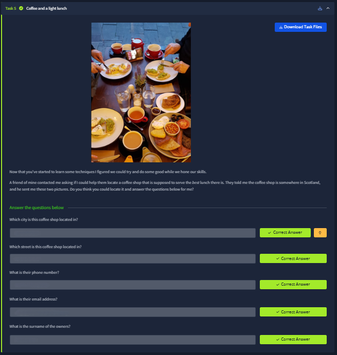
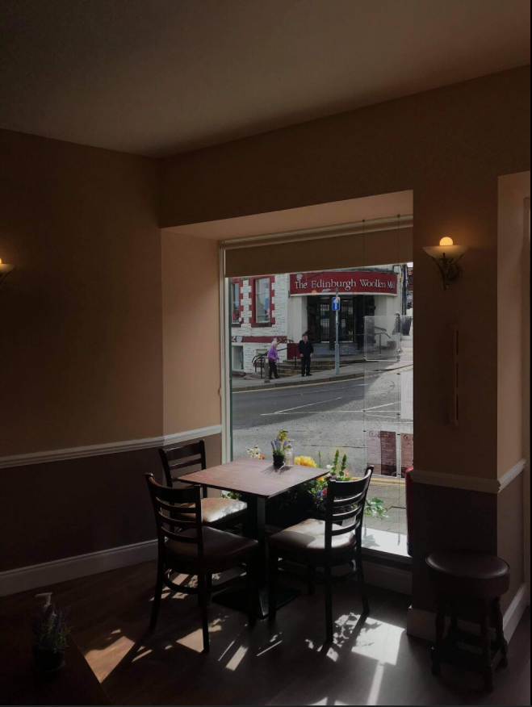
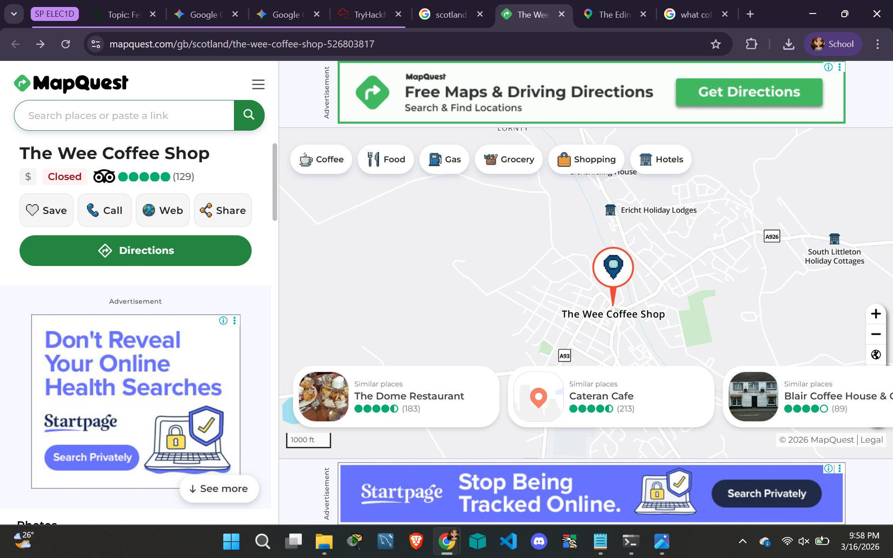
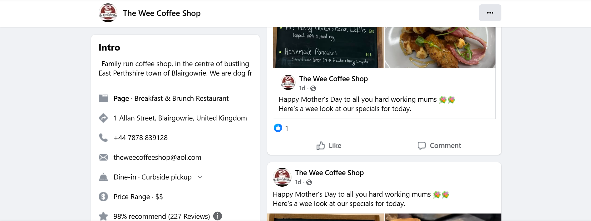
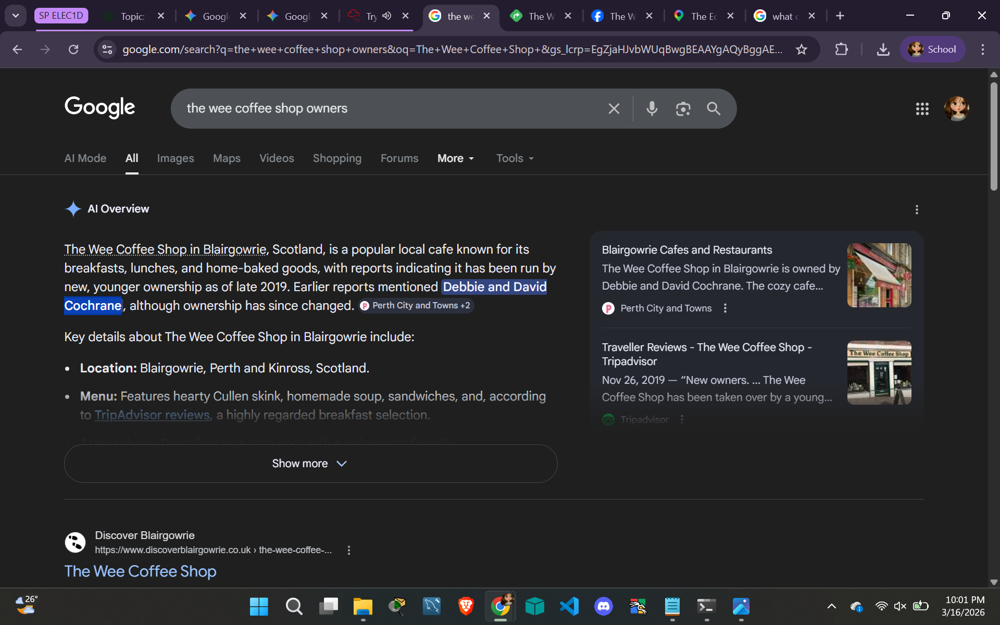

# 📝 Challenge Write-up: Searchlight - IMINT (Task 5)

| Attribute | Details |
| :--- | :--- |
| **Event** | TryHackMe |
| **Category** | IMINT / OSINT |
| **Difficulty** | Easy |
| **Target File** | `task5_1602347907147.jpg` |

## 1. The Challenge Scenario
Task 5 ("Coffee and a light lunch") ramps up the difficulty by requiring us to identify a specific business and completely profile it based on a single interior photograph. The prompt tells us the target is somewhere in Scotland, and we need to uncover the city, street name, phone number, email address, and the surname of the owners.

## 2. The Step-by-Step Solution
This challenge required pivoting from visual extraction to map reconnaissance, and finally to social media enumeration to gather all the required flags.

**Step 1: Visual Extraction from the Background**
Looking at the provided interior image of the cafe, the most crucial clue is directly out the window. Across the street, there is a prominent storefront with a red awning that clearly reads: **The Edinburgh Woollen Mill**. Since the prompt already confirmed we are in Scotland, this gives us a strong physical anchor. 

**Step 2: Locating the Coffee Shop (MapQuest Reconnaissance)**
By using Google Lens/Search on the image and cross-referencing coffee shops located directly across from "The Edinburgh Woollen Mill" locations in Scotland, the search pointed to a specific cafe. Checking MapQuest confirmed the location: **The Wee Coffee Shop**. 
MapQuest provided the physical address (answering the first two questions): **1 Allan Street, Blairgowrie**. Furthermore, the user-uploaded interior photos on MapQuest perfectly matched the wooden chairs, tables, and wall colors seen in our target image, confirming the match.

**Step 3: Finding the Contact Information (Facebook)**
Now that the business was positively identified as "The Wee Coffee Shop," I needed to find their contact details. A quick search for the business's social media led to their official Facebook page. Looking at the "Intro/About" section on their profile instantly revealed the required phone number (**+44 7878 839128**) and their contact email (**theweecoffeeshop@aol.com**).

**Step 4: Uncovering the Owners' Surname (Google Dorking)**
The final piece of the puzzle was finding the owners' surname. I performed a highly specific Google search query: *"the wee coffee shop owners"*. The Google AI Overview and linked articles (such as from Discover Blairgowrie) explicitly stated that the shop is run by Debbie and David **Cochrane**. 

*(Note: The screenshots regarding Katz's Deli were not relevant to this specific task and were successfully filtered out of the investigation!)*

## 3. The Findings
By chaining visual clues to mapping software and social media, we extracted all the required intelligence to answer the prompts:

* **Which city is this coffee shop located in?** `sl{blairgowrie}`
* **Which street is this coffee shop located in?** `sl{allan street}`
* **What is their phone number?** `sl{+447878 839128}`
* **What is their email address?** `sl{theweecoffeeshop@aol.com}`
* **What is the surname of the owners?** `sl{cochrane}`

## 4. Conclusion
This task was a masterclass in full-cycle OSINT. It perfectly illustrated how a single piece of background information (a neighboring storefront) can be used to geolocate a building. Once the physical building is identified, investigators can easily pivot to open web sources—like Facebook and local news articles—to build a complete profile of the target, including highly specific personal details like phone numbers and family names.
