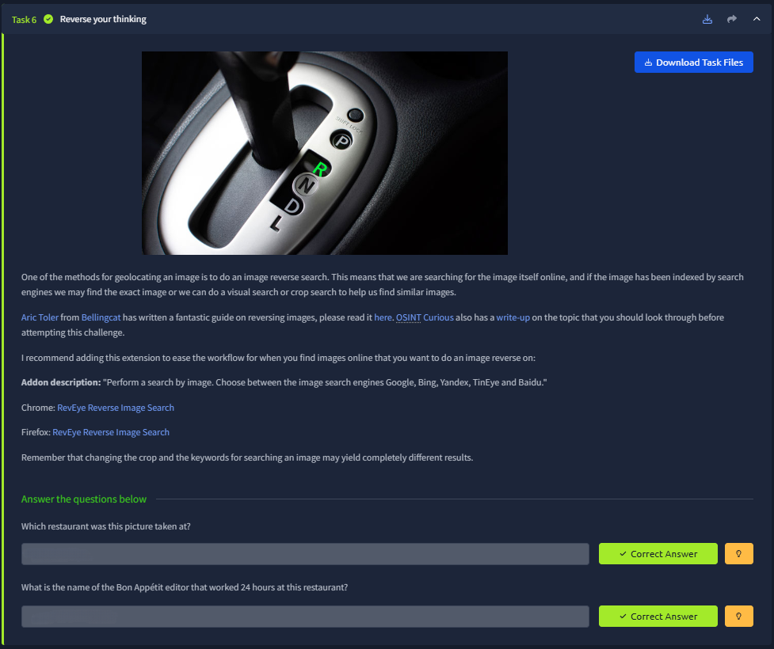
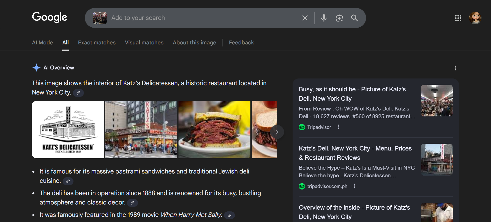
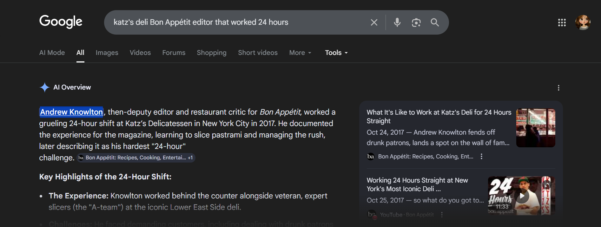

# 📝 Challenge Write-up: Searchlight - IMINT (Task 6)

| Attribute | Details |
| :--- | :--- |
| **Event** | TryHackMe |
| **Category** | IMINT / OSINT |
| **Difficulty** | Easy |
| **Target File** | `task6_1602348602115.jpg` |

## 1. The Challenge Scenario
Task 6 ("Reverse your thinking") formally introduces **Reverse Image Searching**. The objective was to take a photograph of a crowded, busy restaurant interior and use search engines to identify the establishment. Once identified, the challenge required finding specific trivia about a magazine editor who worked a 24-hour shift there.

## 2. The Step-by-Step Solution
By relying on reverse image search rather than manual visual scanning, the location was identified instantly, paving the way for a quick trivia search.

**Step 1: Reverse Image Search**
I downloaded the target file (`task6_1602348602115.jpg`), which showed the bustling interior of a deli with neon signs and crowded tables. I uploaded this image directly into Google Image Search. The search engine immediately matched the highly distinct interior, identifying it as the world-famous **Katz's Delicatessen** in New York City.

**Step 2: Contextual Google Search**
With the restaurant identified, I moved on to the trivia question. I performed a highly specific Google search query combining the restaurant name with the prompt's exact details: *"katz's deli Bon Appétit editor that worked 24 hours"*. The AI Overview and the top resulting articles and YouTube videos immediately revealed that the editor who completed this grueling shift in 2017 was **Andrew Knowlton**.

## 3. The Findings
The reverse image search combined with targeted keyword querying provided the exact flags needed to pass the task:

* **Which restaurant was this picture taken at?** `sl{katz's deli}`
* **What is the name of the Bon Appétit editor that worked 24 hours at this restaurant?** `sl{andrew knowlton}`

## 4. Conclusion
This task demonstrated the sheer power of Reverse Image Searching. When visual clues (like specific street signs or readable banners) are absent or too blurry, search engines can analyze the unique geometry, colors, and layout of a room to find matching photos indexed on travel sites like TripAdvisor. Once the location is confirmed, finding specific secondary information is just a standard Google search away.
