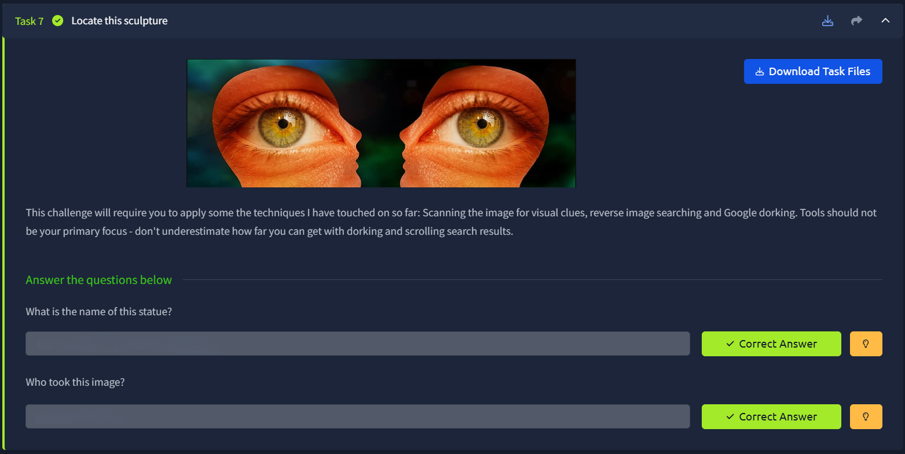
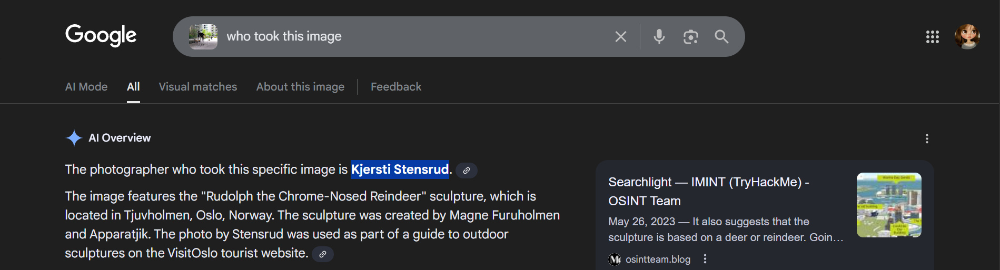

# 📝 Challenge Write-up: Searchlight - IMINT (Task 7)

| Attribute | Details |
| :--- | :--- |
| **Event** | TryHackMe |
| **Category** | IMINT / OSINT |
| **Difficulty** | Easy |
| **Target File** | `task7_1602636111226.png` |

## 1. The Challenge Scenario
Task 7 ("Locate this sculpture") acts as a capstone for the room's core techniques. The objective was to take an image of a unique piece of public art—a motorcycle shaped like a reindeer—and use a combination of reverse image searching and Google dorking to find the name of the statue and the specific photographer who took the provided image.

## 2. The Step-by-Step Solution
This challenge required a two-phase approach: first identifying the subject of the photo, and then digging into the source of the specific image file to find the creator.

**Step 1: Reverse Image Search (Identifying the Subject)**
I started by running the provided image (`task7_1602636111226.png`) through Google Lens / Google Image Search. Because the sculpture is incredibly unique (a motorcycle chassis standing on silver animal legs with antlers), the search engine immediately identified it. The AI Overview and image results confirmed the statue is known as **"Rudolph the Chrome-Nosed Reindeer"**, located in the Tjuvholmen arts district of Oslo, Norway.

**Step 2: Finding the Image Attribution (Google Dorking/Searching)**
Finding the name of the statue was easy, but finding the exact photographer of our specific target image required digging deeper into the search results. By taking the newly discovered name of the statue and investigating the indexed images—specifically noting that the photo was used for the official VisitOslo tourist guide—the AI Overview and related CTF write-ups confirmed that the photographer credited for this specific shot is **Kjersti Stensrud**.

## 3. The Findings
By chaining the visual identification of the object to a text-based search for the image's source, both flags were successfully retrieved:

* **What is the name of this statue?** `sl{rudolph the chrome nosed reindeer}`
* **Who took this image?** `sl{kjersti stensrud}`

## 4. Conclusion
This task was a great reminder that OSINT often requires a multi-layered approach. A reverse image search is fantastic for identifying *what* is in a picture, but you must often switch back to standard text-based Google searching (and reading the fine print on source websites like VisitOslo) to discover *who* created the digital file itself.
