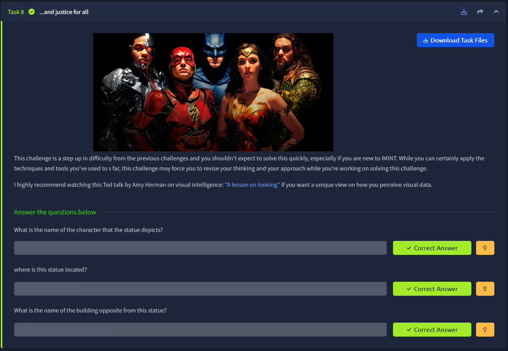
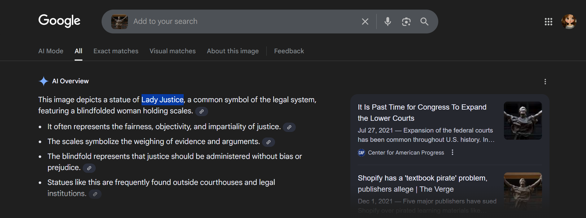

# 📝 Challenge Write-up: Searchlight - IMINT (Task 8)

| Attribute | Details |
| :--- | :--- |
| **Event** | TryHackMe |
| **Category** | IMINT / OSINT |
| **Difficulty** | Medium |
| **Target File** | Task 8 Image (Lady Justice Statue) |

## 1. The Challenge Scenario
Task 8 ("...and justice for all") explicitly warns that it is a step up in difficulty. The objective was to take an image of a specific statue, identify the mythological or symbolic character it depicts, geolocate the exact city and state of this specific casting, and finally use map reconnaissance to identify the business located directly across the street.

## 2. The Step-by-Step Solution
Because statues like this are mass-produced or feature highly similar artistic elements worldwide, finding the *exact* location required pairing reverse image searching with targeted map navigation.

**Step 1: Identifying the Subject**
Taking the target image of the blindfolded woman holding scales and running it through Google Image Search instantly provided the symbolic identity. The AI Overview and top results confirmed that this classic legal symbol is known as **Lady Justice**.

**Step 2: Geolocating the Exact Statue**
While Google Lens is great for identifying the *type* of object, finding the specific location often requires testing different search engines (like Yandex or Bing) or adding context words. Since Lady Justice statues are almost always at legal institutions, searching for the image alongside the keyword "courthouse" pulls up the exact match: the **Albert V. Bryan United States Courthouse**. 
A quick search of this specific federal courthouse confirms it is located in **Alexandria, Virginia**.

**Step 3: Spatial Reconnaissance (Google Street View)**
To find the building opposite the statue, standard text searching is no longer effective. I opened Google Maps, searched for the "Albert V. Bryan U.S. Courthouse, Alexandria, VA," and dropped into Street View. By standing on the sidewalk next to the Lady Justice statue and panning the camera 180 degrees to look directly across the street, a large hotel comes into view. The signage confirms it is **The Westin Alexandria Old Town**.

## 3. The Findings
By combining reverse image searching to identify the subject, keyword association to find the specific courthouse, and Google Street View to look at the surrounding environment, all three flags were secured:

* **What is the name of the character that the statue depicts?** `sl{lady justice}`
* **where is this statue located?** `sl{alexandria, virginia}`
* **What is the name of the building opposite from this statue?** `sl{the westin alexandria old town}`

## 4. Conclusion
This task was an excellent lesson in OSINT tool limitations and map reconnaissance. It proved that while an image search can tell you *what* an object is, you often have to manually investigate the physical surroundings using tools like Google Earth or Street View to answer relational questions (like what sits across the street).
