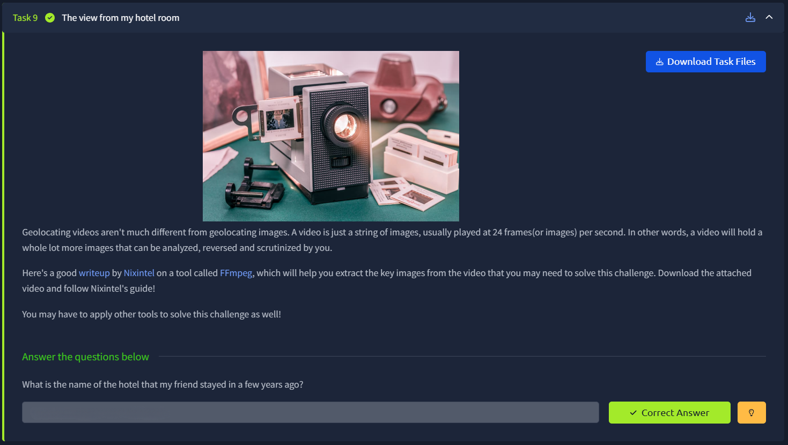
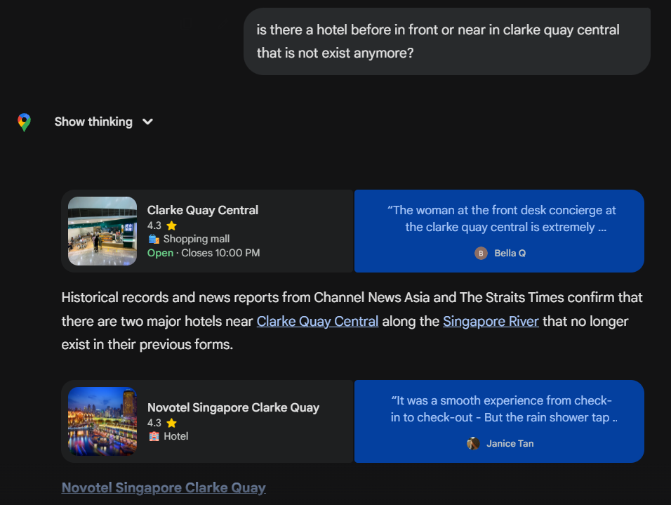

# 📝 Challenge Write-up: Searchlight - IMINT (Task 9)

| Attribute | Details |
| :--- | :--- |
| **Event** | TryHackMe |
| **Category** | IMINT / OSINT |
| **Difficulty** | Medium |
| **Target File** | Task 9 Video File |

## 1. The Challenge Scenario
Task 9 ("The view from my hotel room") shifts the focus from static images to video files. The prompt explains that videos are just strings of images and suggests extracting frames for analysis. The objective was to geolocate the exact hotel where the video was filmed "a few years ago" by analyzing the skyline and surrounding buildings visible from the room's window.

## 2. The Step-by-Step Solution
This challenge required an excellent pivot from standard map reconnaissance to historical OSINT, as the physical landscape of the location had changed since the video was recorded.

**Step 1: Video Analysis & Visual Clues**
Instead of using external tools like FFmpeg to extract frames, I carefully watched the video and manually scanned the environment. I successfully spotted two major visual anchors across the water: prominent building signs reading **Riverside Point** and **Clarke Quay Central**. 

**Step 2: Spatial Reconnaissance (Google Street View)**
With the names of the buildings secured, I opened Google Maps and dropped into Street View to virtually walk the area. By looking at the positions of Riverside Point and Clarke Quay Central, I attempted to reverse-engineer the videographer's line of sight to find the hotel they were filming from. 

**Step 3: The "Ghost" Hotel Pivot**
This is where the challenge got tricky. Looking back from Clarke Quay Central towards where the camera *should* have been, no current hotel on the map matched the correct angle or view. Taking a hint from the challenge description (which stated the friend stayed there *"a few years ago"*), I hypothesized that the building might have been demolished or rebranded.

**Step 4: Historical Search Query**
To test this theory, I ran a targeted search asking: *"is there a hotel before in front or near in clarke quay central that is not exist anymore?"* The search engine confirmed the theory perfectly, revealing that the **Novotel Singapore Clarke Quay** used to occupy that exact space before it was closed and demolished.

## 3. The Findings
By tracking down the line of sight and accounting for changes in the city's architecture over time, the exact missing hotel was identified:

* **What is the name of the hotel that my friend stayed in a few years ago?** `sl{novotel singapore clarke quay}`

## 4. Conclusion
This was a brilliant challenge that highlighted a crucial aspect of Image Intelligence (IMINT): **Temporal OSINT**. Google Maps and Earth show the world as it is *today* (or at the time of the most recent satellite pass). If a photo or video was taken years ago, you must account for urban development. Recognizing when a physical location doesn't match the map and pivoting to historical news searches about demolished or rebranded buildings is the mark of an advanced investigator.
