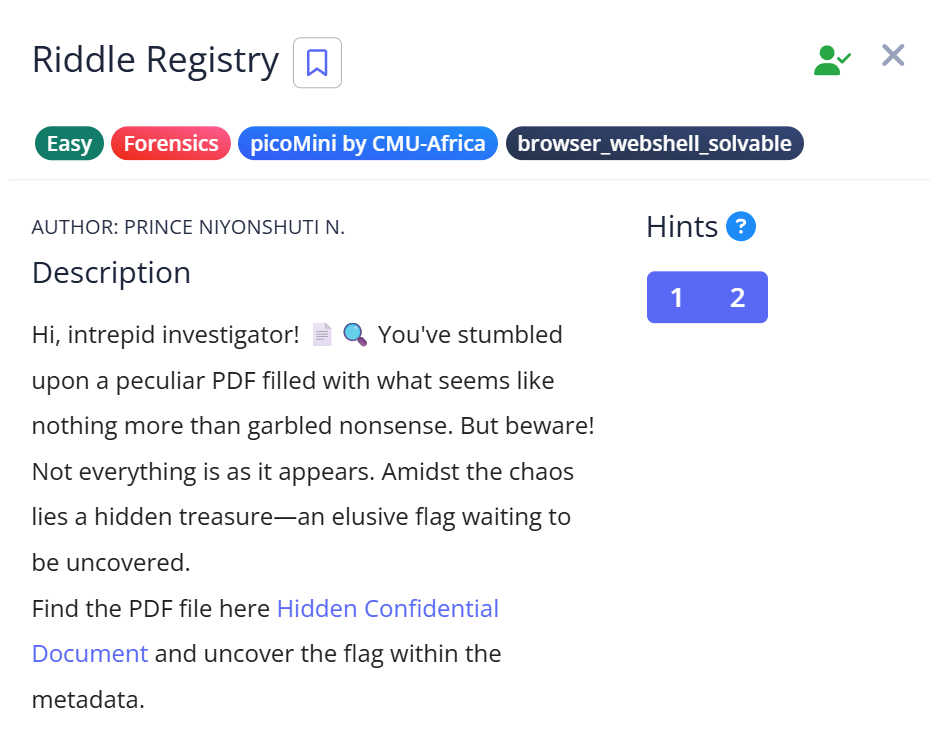
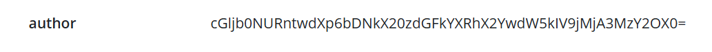
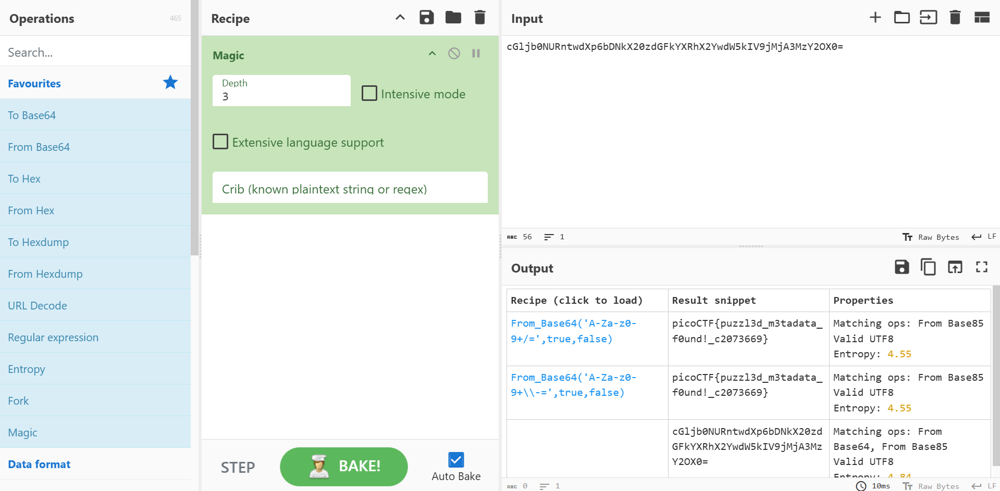

# 📝 Challenge Write-up: Riddle Registry

| Attribute | Details |
| :--- | :--- |
| **Event** | picoCTF (picoMini by CMU-Africa) |
| **Category** | Forensics / Metadata / Encoding |
| **Difficulty** | Easy |
| **Target File** | PDF Document (`Hidden Confidential Document`) |

## 1. The Challenge Scenario
We were provided with a peculiar PDF filled with garbled nonsense and blacked-out text. The description explicitly warned that the visible text was just a decoy and directed the investigation toward uncovering a hidden flag within the file's metadata.

## 2. The Step-by-Step Solution
Since this was an initial foray into digital forensics, the investigation started with manual visual inspection before moving to specialized analysis tools.

**Step 1:** I opened the document to read the visible text and attempted to highlight/copy the text hidden behind the black redaction boxes. This yielded no results, confirming the visual elements were purely a decoy.

**Step 2:** Following the challenge hint regarding metadata, I moved away from visual inspection and uploaded the PDF to an online extraction tool: `www.metadata2go.com`.

**Step 3:** I carefully examined every detail in the generated metadata report. I noticed a highly unusual, random-looking string of characters populated in the **Author** field.

**Step 4:** By researching the format of this strange string (`cGljb0NURntwdXp6bDNkX20zdGFkYXRhX2YwdW5kIV9jMjA3MzY2OX0=`), I identified it as potential **Base64** encoding.

**Step 5:** I copied the encoded string and pasted it into **CyberChef**. Using the "Magic" operation (which automatically detects and decodes various data formats), I translated the Base64 text back into readable plain text.

## 3. The Findings
The metadata extraction successfully bypassed the decoy PDF content:
* **Suspicious Field:** The `Author` property contained the Base64 encoded string `cGljb0NURntwdXp6bDNkX20zdGFkYXRhX2YwdW5kIV9jMjA3MzY2OX0=` rather than a standard name.
* **Decoded Output:** Running the string through CyberChef successfully decoded the text, revealing the hidden CTF flag: `picoCTF{puzzl3d_m3tadata_f0und!_c2073669}`

## 4. Conclusion
This challenge served as a perfect introduction to digital forensics. It demonstrated a fundamental rule: never trust just the visible content of a file. It also introduced the critical concepts of metadata analysis and recognizing basic data encoding (Base64), proving that web-based tools are highly effective for rapid initial triage before moving to command-line utilities.
