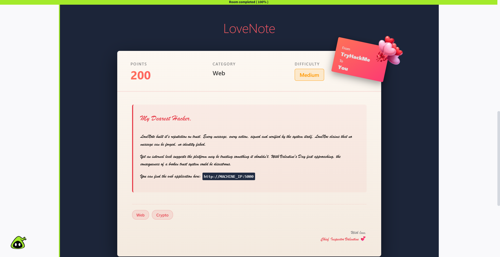

# 📝 Challenge Write-up: LoveNote

| Attribute | Details |
| :--- | :--- |
| **Event** | TryHackMe - Love at First Breach |
| **Category** | Web, Crypto |
| **Difficulty** | Medium |
| **Target URL** | `http://MACHINE_IP:5000` |

## 1. The Challenge Scenario
The challenge introduced our team to "LoveNote," a platform that built its reputation on trust. The system claims that every message and action is signed and verified, meaning no identity can be faked. However, the briefing hinted at an internal leak suggesting the platform trusts something it shouldn't, warning that the consequences of this broken trust system could be disastrous.



## 2. The Step-by-Step Solution
Our team analyzed the cryptographic implementation and utilized a custom script to forge an administrator signature by exploiting a predictable seed vulnerability.

**Step 1: Initial Reconnaissance and Fuzzing**

We started by fuzzing the web application's directories using `dirsearch`. This scan revealed a hidden `/debug` endpoint. Visiting this endpoint exposed system debug logs, which provided insight into how user accounts and registration processes were handled by the backend.

**Step 2: Understanding the Cryptographic Flow**

By exploring the application, we learned how its signature system worked. When a user creates an account, a unique RSA 2048 keypair is generated. Messages composed on the site are hashed using SHA-256 and signed with the user's private key. A separate verification page allows users to verify these messages by inputting the original message alongside the hex-formatted digital signature.

**Step 3: Targeting the Admin Account**

We deduced that to retrieve the flag, we needed to verify a signed message specifically belonging to the `admin` user. However, we could not simply register as `admin` because the username was explicitly reserved for system use. 

**Step 4: Forging the Signature (Predictable Seed Exploit)**

Taking advantage of the cryptographic flaw, we ran a Python exploit script designed to bypass the key generation process. Because the server used a predictable pseudo-random number generator (PRNG) seed to generate the RSA keys, the script was able to calculate and recreate the exact same private key the server originally assigned to the `admin` account.
* We executed the script and inputted our target username: `admin`. 
* We then inputted a simple string for the message payload: `test`. 
* The script successfully recreated the admin's private key locally and used it to sign the "test" message, outputting a valid digital signature in hex format.

**Step 5: Bypassing the Verification**

We navigated to the application's signature verification portal. We entered `admin` as the username, `test` as the message, and pasted the forged hex digital signature generated by our script. Upon clicking "verify signature," the application correctly validated the signature against the admin's public key, proving we had successfully impersonated the administrator, and immediately revealed the flag below the input form.

## 3. The Findings
By exploiting a predictable random seed used in the RSA key generation process, we successfully recreated the administrator's private key and forged a valid signature.

```text
THM{PR3D1CT4BL3_S33D5_BR34K_H34RT5}
```

**Target Found:** `THM{PR3D1CT4BL3_S33D5_BR34K_H34RT5}`

## 4. Conclusion
This challenge highlighted a critical vulnerability in cryptographic implementations: insecure randomness. While the application utilized strong algorithms like RSA 2048 and SHA-256, it completely undermined its own security by using a predictable seed during the key generation phase. As explicitly stated in the flag, predictable seeds allow attackers to deterministically recreate "secure" private keys, entirely breaking the trust mechanism of the digital signature system.
