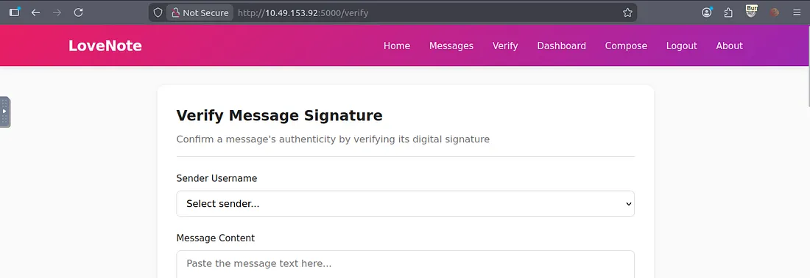

# 📝 Challenge Write-up: Deep Into my Heart

| Attribute | Details |
| :--- | :--- |
| **Event** | TryHackMe - Love at First Breach |
| **Category** | Web |
| **Difficulty** | Medium |


## 1. The Challenge Scenario
This write-up covers the "Signed Messages" challenge on TryHackMe, where a major flaw in RSA key generation basically broke the whole system. Because the keys were generated in a predictable way instead of being actually random, I was able to reconstruct the admin's private key from scratch. With that key in hand, I could forge my own digital signatures, allowing me to trick the server into verifying my fake messages as official admin commands.



## 2. The Step-by-Step Solution
Our team used directory enumeration and careful analysis of publicly exposed files to discover the hidden administrative interface.

**Step 1: Initial Reconnaissance**

We accessed the target URL at port 5000 and were greeted by an anonymous message board. Inspecting the page source did not reveal any immediate vulnerabilities, input fields, or hidden comments.

**Step 2: Directory Enumeration with GoBuster**

To map out the application, we initiated a directory brute-force scan using `gobuster` along with the `common.txt` wordlist. The scan discovered two interesting paths: `/console` (which returned a 400 Bad Request error) and `/robots.txt` (which returned a 200 OK status).

**Step 3: Analyzing `robots.txt`**

We navigated to the exposed `robots.txt` file and found an entry pointing to a hidden directory named `cupid_secret_vault`, followed by a hash-like string. We saved this hash value to a local file for later use.

**Step 4: Further Enumeration of the Secret Vault**

We visited the hidden `/cupid_secret_vault` directory, which displayed a message indicating we had found the vault but there was "more to discover". We ran a second `gobuster` scan specifically targeting this new `/cupid_secret_vault` path. This scan successfully revealed an `/administrator` directory (200 OK status).

**Step 5: The Administrator Login panel**

Navigating to the `/cupid_secret_vault/administrator` endpoint brought us to a login page requiring a username and password. We captured the login request using Burp Suite and initially attempted to test for SQL Injection vulnerabilities. We saved the request to a file (`SQL.txt`) and ran it through `sqlmap`, but determined the login was not vulnerable to SQLi.

**Step 6: Credential Re-use**

Given the "Easy" difficulty of the room, we reconsidered the information we had already gathered. We attempted to log in using a standard administrative username (`admin`) alongside the hash-like string we previously discovered in the `robots.txt` file acting as the password.

## 3. The Findings
Using the credentials `admin` and the hash string from the `robots.txt` file, the authentication was successful. We bypassed the login panel and were presented with a congratulatory message revealing the hidden flag.

```text
THM{Love_is_in_the_robots_txt}
```

**Target Found:** `THM{Love_is_in_the_robots_txt}`

## 4. Conclusion
This challenge highlighted the critical importance of secure configuration. By placing sensitive directory paths and a plaintext credential (the hash) inside the public-facing `robots.txt` file, the developer unintentionally gave attackers a roadmap to the hidden administrative portal and the exact keys needed to bypass authentication entirely.
