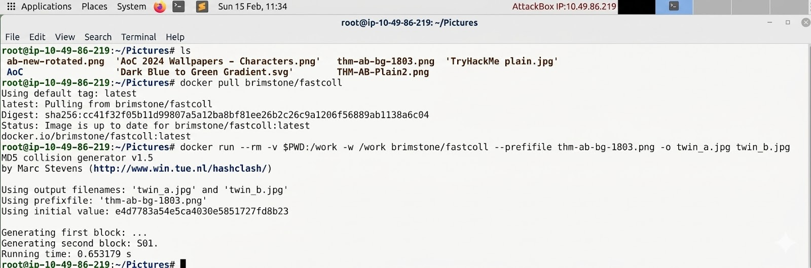
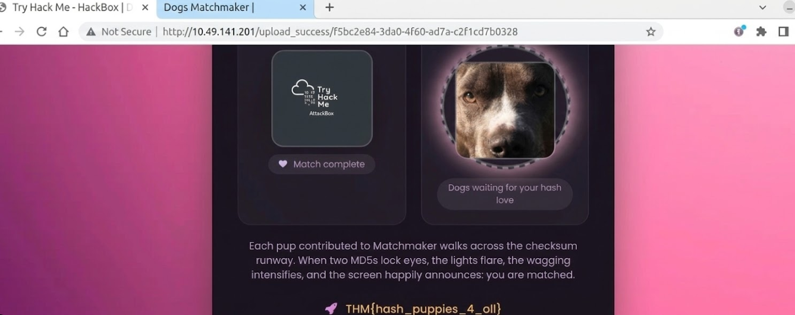

# 📝 Challenge Write-up: When Hearts Collide

| Attribute | Details |
| :--- | :--- |
| **Event** | TryHackMe — When Hearts Collide |
| **Category** | Cryptography / Web |
| **Difficulty** | Medium |

---

## 1. The Challenge Scenario

For this part, we were hit with a puzzle involving MD5 hash collisions themed around dog pictures. The room basically gave us a heads-up that two different images of dogs actually share the exact same MD5 hash. It’s a classic example of a hash collision, where two totally unique files end up with the same digital fingerprint. Even though this can technically happen with any hash function, MD5 is notorious for being broken because it's super easy for researchers to purposefully engineer these overlaps. This challenge really drives home why you can't just blindly trust MD5 for integrity checks anymore, since it's way too easy to exploit.

---

## 2. The Step-by-Step Solution

We determined that our solution required generating two image files that share an identical MD5 hash value, then uploading them both to the challenge application to satisfy its verification check.

### Step 1: Navigate to the Working Directory

We started by navigating into the Pictures directory where the base image was stored:

```bash
cd Pictures
```

### Step 2: Pull the fastcoll Docker Image

We chose `fastcoll`, a well-known MD5 collision generator, and pulled it using Docker to avoid any local dependency issues:

```bash
docker pull brimstone/fastcoll
```

### Step 3: Generate the Colliding Files

Using the provided base image (`thm-ab-bg-1803.png`) as a prefix, we ran the fastcoll tool to produce two output files — `twin_a.jpg` and `twin_b.jpg` — that would share the same MD5 hash:

```bash
docker run --rm -v $PWD:/work -w /work \
  brimstone/fastcoll --prefixfile thm-ab-bg-1803.png \
  -o twin_a.jpg twin_b.jpg
```


After execution, we confirmed that both files had identical MD5 digests despite being different files by running:

```bash
md5sum twin_a.jpg twin_b.jpg
```

### Step 4: Upload Both Files to the Application

We navigated to the challenge web application and uploaded both generated files one by one. The application verified that the two uploaded files shared the same MD5 hash — and since our collision-generated pair satisfied this condition, it accepted them and revealed the flag.

---

## 3. The Findings

By exploiting the mathematical weakness of the MD5 hashing algorithm, we successfully engineered two distinct image files with an identical hash digest. Uploading these to the challenge application allowed us to bypass its integrity check, revealing the flag:



```
THM{hash_puppies_4_all}
```

**🏁 Flag:** `THM{hash_puppies_4_all}`

Through this process, we made the following key technical observations:

- MD5 is cryptographically broken and must not be used for integrity or security-critical checks.
- We found that the `fastcoll` tool can generate MD5 collisions in seconds on modern hardware.
- By using a shared prefix (the original image), we ensured both output files appeared visually similar, demonstrating how stealthy this attack can be in real-world scenarios.
- We confirmed that any system relying solely on MD5 to distinguish or verify files is trivially bypassable using this technique.

---

## 4. Conclusion

This challenge was a great way to get some hands-on experience with a real-world crypto weakness. Even though you still see MD5 popping up in older systems or for basic file checks, it’s basically been considered broken since the early 2000s when people figured out how to actually force collisions.

The biggest takeaway for us was that the strength of the algorithm matters just as much as how you use it. You can design a system perfectly, but if you pick a weak link like MD5, the whole security model just falls apart. Honestly, if you're doing anything security-sensitive, you're much better off sticking to collision-resistant options like SHA-256 or SHA-3.
